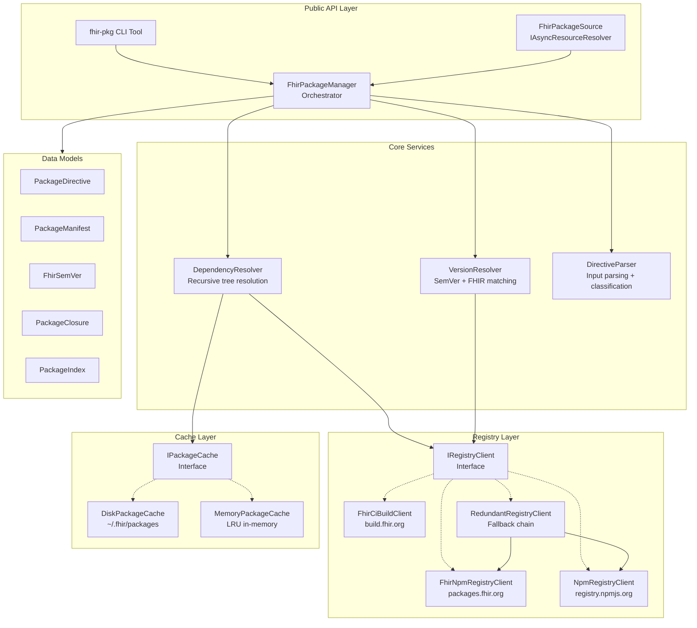

# Proposal: fhir-pkg — C# FHIR Package Management Library & CLI

## Executive Summary

This proposal defines a new C# library and CLI tool for client-side FHIR package management. The library consolidates the best features from the four major reference implementations (SUSHI/fhir-package-loader in TypeScript, FhirPkg in C#, Fhir.CodeGen.Packages in C#, and the Java IG Publisher) into a single, comprehensive, well-tested .NET SDK.

The resulting library will be the definitive C# solution for discovering, resolving, downloading, caching, and managing FHIR packages from multiple registries — including published releases, CI builds, and private registries.

## Goals

1. **Complete feature coverage** — Support every resolution path (Published IG, Published Core, CI Build IG, CI Build Core), all version formats (exact, wildcard, tags, ranges), NPM aliases, and multi-registry querying.
2. **Production quality** — Async-first APIs, thread-safe cache access, atomic installation, SHA checksum verification, and comprehensive error handling.
3. **Developer experience** — Clean interface-based design, dependency injection friendly, rich configuration, and a batteries-included CLI tool.
4. **Testability** — Every component testable in isolation via interfaces, with extensive unit and integration test suites.
5. **Performance** — Parallel registry queries, LRU in-memory resource caching, and efficient disk cache management.

## Target Platform

- **.NET:** 9.0+
- **C#:** 13+
- **NuGet Package:** `dotnet fhir-packages` (library), `fhir-pkg` (CLI tool)

## Document Index

| Document | Description |
|----------|-------------|
| [API Surface](api-surface.md) | Complete API design: interfaces, classes, models, enums, and usage examples |
| [CLI Documentation](cli-documentation.md) | CLI tool reference: commands, options, environment variables, and exit codes |
| [Implementation Plan](implementation-plan.md) | Phased implementation plan with milestones and project structure |
| [Unit Tests](unit-tests.md) | Unit test strategy with detailed test cases per component |
| [Integration Tests](integration-tests.md) | Integration test strategy with end-to-end scenarios |

## Architecture Overview



## Design Principles

### 1. Interface-First Design

Every major component is defined as an interface, enabling:
- Dependency injection in host applications
- Easy mocking for unit tests
- Alternative implementations (e.g., in-memory cache for testing, custom registry clients)

### 2. Async-First with CancellationToken

All I/O operations are async and accept `CancellationToken` for cooperative cancellation:

```csharp
Task<PackageRecord?> InstallAsync(
    string directive,
    InstallOptions? options = null,
    CancellationToken cancellationToken = default);
```

### 3. Immutable Data Models

Package metadata models use `record` types for immutability and value semantics:

```csharp
public record PackageManifest(string Name, string Version, ...);
public record PackageDirective(string PackageId, string Version, ...);
```

### 4. Configuration via Options Pattern

Following .NET conventions, configuration uses the Options pattern with sensible defaults:

```csharp
services.Configure<FhirPackageManagerOptions>(options =>
{
    options.CachePath = "~/.fhir/packages";
    options.Registries.Add(new RegistryEndpoint("https://my-registry.example.com"));
});
```

### 5. Comprehensive Logging

All components use `ILogger<T>` from `Microsoft.Extensions.Logging` for structured logging at appropriate levels (Trace, Debug, Information, Warning, Error).

## Feature Matrix — Existing vs. Proposed

| Feature | SUSHI | Firely | CodeGen | Java | **Proposed** |
|---------|-------|--------|---------|------|--------------|
| Disk cache | ✅ | ✅ | ✅ | ✅ | **✅** |
| In-memory resource cache (LRU) | ✅ | ❌ | ❌ | ❌ | **✅** |
| CI build resolution | ✅ | ❌ | ✅ | ✅ | **✅** |
| Branch-specific CI builds | ✅ | ❌ | ✅ | ❌ | **✅** |
| Wildcard versions | Partial | Full | Full | ❌ | **✅ Full** |
| SemVer version ranges | ❌ | ✅ | ❌ | ❌ | **✅** |
| NPM alias support | ❌ | ✅ | ✅ | ❌ | **✅** |
| NPM scoped packages | ❌ | ✅ | ❌ | ❌ | **✅** |
| Custom registry auth | ✅ | ✅ | ✅ | ❌ | **✅** |
| Proxy support | ✅ | ❌ | ❌ | ❌ | **✅** |
| Virtual packages | ✅ | ❌ | ❌ | ❌ | **✅** |
| Package publish | ❌ | ✅ | ❌ | ❌ | **✅** |
| Lock file | ❌ | ✅ | ❌ | ❌ | **✅** |
| Full dependency tree restore | ❌ | ✅ | ❌ | ✅ | **✅** |
| Parallel registry queries | ❌ | ❌ | ✅ | ❌ | **✅** |
| Resource type indexing | ✅ | ✅ | ✅ | ✅ | **✅** |
| StructureDefinition flavor | ✅ | ✅ | ❌ | ❌ | **✅** |
| SHA checksum verification | ❌ | ✅ | ✅ | ❌ | **✅** |
| CLI tool | ✅ | ❌ | ❌ | Partial | **✅** |
| HL7 website fallback | ❌ | ❌ | ❌ | ✅ | **✅** |
| Package-list.json resolution | ❌ | ❌ | ❌ | ✅ | **✅** |
| Known package fixups | ❌ | ❌ | ❌ | ✅ | **✅** |
| packages.ini management | ❌ | ❌ | ✅ | ✅ | **✅** |
| Configurable safe mode (LRU) | ✅ | ❌ | ❌ | ❌ | **✅** |

## Registries Supported

| Registry | URL | Type | Auth |
|----------|-----|------|------|
| Primary (Firely) | `packages.fhir.org` | FHIR NPM | Public |
| Secondary (HL7) | `packages2.fhir.org` | FHIR NPM | Public |
| CI Builds | `build.fhir.org` | FHIR CI | Public |
| HL7 Website | `hl7.org/fhir` | HTTP Direct | Public |
| NPM Registry | `registry.npmjs.org` | NPM | Public/Token |
| Custom/Private | User-configured | FHIR NPM / NPM | Token/Header |

## Key Workflows

### Install a Package

```csharp
var manager = new FhirPackageManager();
var record = await manager.InstallAsync("hl7.fhir.us.core#6.1.0");
Console.WriteLine(record.PackagePath); // ~/.fhir/packages/hl7.fhir.us.core#6.1.0/package
```

### Restore All Dependencies

```csharp
var manager = new FhirPackageManager();
var closure = await manager.RestoreAsync("./my-ig");
foreach (var dep in closure.Resolved)
    Console.WriteLine($"{dep.Name}@{dep.Version}");
```

### CLI Quick Start

```bash
# Install a package
fhir-pkg install hl7.fhir.us.core#6.1.0

# Restore dependencies from a project
fhir-pkg restore ./my-ig

# List cached packages
fhir-pkg list

# Search registries
fhir-pkg search --name hl7.fhir.us.core --fhir-version R4
```

## Out of Scope

The following are explicitly **not** part of this proposal:

- **Browser/WASM support** — May be considered in a future phase
- **FHIR resource parsing/validation** — This library manages packages, not FHIR content
- **IG publishing/building** — Separate tooling concern
- **Server-side registry implementation** — This is a client-only library
