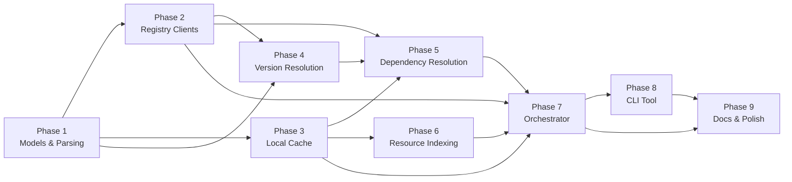

# Implementation Plan

This document defines the phased implementation plan for the FHIR Package Management library and CLI tool.

## Project Structure

```
Firely.Fhir.Packages/
├── Firely.Fhir.Packages.sln
├── README.md
├── LICENSE
│
├── src/
│   ├── Firely.Fhir.Packages/                # Core library
│   │   ├── Firely.Fhir.Packages.csproj
│   │   ├── Models/
│   │   │   ├── PackageReference.cs
│   │   │   ├── PackageDirective.cs
│   │   │   ├── PackageManifest.cs
│   │   │   ├── FhirSemVer.cs
│   │   │   ├── PackageClosure.cs
│   │   │   ├── PackageLockFile.cs
│   │   │   ├── PackageRecord.cs
│   │   │   ├── PackageListing.cs
│   │   │   ├── PackageVersionInfo.cs
│   │   │   ├── CatalogEntry.cs
│   │   │   ├── CiBuildRecord.cs
│   │   │   ├── CiBuildManifest.cs
│   │   │   ├── NpmModels.cs
│   │   │   ├── FhirRelease.cs
│   │   │   └── Enums.cs
│   │   ├── Registry/
│   │   │   ├── IRegistryClient.cs
│   │   │   ├── RegistryEndpoint.cs
│   │   │   ├── FhirNpmRegistryClient.cs
│   │   │   ├── FhirCiBuildClient.cs
│   │   │   ├── Hl7WebsiteClient.cs
│   │   │   ├── NpmRegistryClient.cs
│   │   │   ├── RedundantRegistryClient.cs
│   │   │   └── RegistryClientBase.cs
│   │   ├── Cache/
│   │   │   ├── IPackageCache.cs
│   │   │   ├── DiskPackageCache.cs
│   │   │   ├── MemoryResourceCache.cs
│   │   │   ├── CacheMetadata.cs
│   │   │   └── TarballExtractor.cs
│   │   ├── Resolution/
│   │   │   ├── IDependencyResolver.cs
│   │   │   ├── DependencyResolver.cs
│   │   │   ├── IVersionResolver.cs
│   │   │   ├── VersionResolver.cs
│   │   │   └── DirectiveParser.cs
│   │   ├── Indexing/
│   │   │   ├── IPackageIndexer.cs
│   │   │   ├── PackageIndexer.cs
│   │   │   ├── PackageIndex.cs
│   │   │   ├── ResourceIndexEntry.cs
│   │   │   └── ResourceInfo.cs
│   │   ├── IFhirPackageManager.cs
│   │   ├── FhirPackageManager.cs
│   │   ├── FhirPackageManagerOptions.cs
│   │   ├── ServiceCollectionExtensions.cs
│   │   └── Utilities/
│   │       ├── CheckSum.cs
│   │       ├── IniParser.cs
│   │       └── PackageFixups.cs
│   │
│   └── Firely.Fhir.Packages.Cli/            # CLI tool
│       ├── Firely.Fhir.Packages.Cli.csproj
│       ├── Program.cs
│       ├── Commands/
│       │   ├── InstallCommand.cs
│       │   ├── RestoreCommand.cs
│       │   ├── ListCommand.cs
│       │   ├── RemoveCommand.cs
│       │   ├── CleanCommand.cs
│       │   ├── SearchCommand.cs
│       │   ├── InfoCommand.cs
│       │   ├── ResolveCommand.cs
│       │   └── PublishCommand.cs
│       └── Formatting/
│           ├── ConsoleOutput.cs
│           └── JsonOutput.cs
│
├── test/
│   ├── Firely.Fhir.Packages.Tests/          # Unit tests
│   │   ├── Firely.Fhir.Packages.Tests.csproj
│   │   ├── Models/
│   │   │   ├── PackageReferenceTests.cs
│   │   │   ├── PackageDirectiveTests.cs
│   │   │   ├── FhirSemVerTests.cs
│   │   │   ├── PackageManifestTests.cs
│   │   │   └── PackageClosureTests.cs
│   │   ├── Registry/
│   │   │   ├── FhirNpmRegistryClientTests.cs
│   │   │   ├── FhirCiBuildClientTests.cs
│   │   │   ├── Hl7WebsiteClientTests.cs
│   │   │   ├── NpmRegistryClientTests.cs
│   │   │   └── RedundantRegistryClientTests.cs
│   │   ├── Cache/
│   │   │   ├── DiskPackageCacheTests.cs
│   │   │   ├── MemoryResourceCacheTests.cs
│   │   │   ├── TarballExtractorTests.cs
│   │   │   └── CacheMetadataTests.cs
│   │   ├── Resolution/
│   │   │   ├── DirectiveParserTests.cs
│   │   │   ├── VersionResolverTests.cs
│   │   │   └── DependencyResolverTests.cs
│   │   ├── Indexing/
│   │   │   └── PackageIndexerTests.cs
│   │   ├── FhirPackageManagerTests.cs
│   │   └── Utilities/
│   │       ├── CheckSumTests.cs
│   │       ├── IniParserTests.cs
│   │       └── PackageFixupsTests.cs
│   │
│   └── Firely.Fhir.Packages.IntegrationTests/  # Integration tests
│       ├── Firely.Fhir.Packages.IntegrationTests.csproj
│       ├── RegistryIntegrationTests.cs
│       ├── CacheIntegrationTests.cs
│       ├── InstallIntegrationTests.cs
│       ├── RestoreIntegrationTests.cs
│       ├── CiBuildIntegrationTests.cs
│       └── CliIntegrationTests.cs
│
└── docs/
    ├── api/                                   # Auto-generated API docs
    └── guides/                                # Usage guides
```

---

## Dependencies

### Core Library (`Firely.Fhir.Packages`)

| Package | Purpose |
|---------|---------|
| `System.Text.Json` | JSON serialization/deserialization |
| `Microsoft.Extensions.Logging.Abstractions` | Structured logging |
| `Microsoft.Extensions.Options` | Options pattern |
| `Microsoft.Extensions.DependencyInjection.Abstractions` | DI registration |
| `Microsoft.Extensions.Http` | HttpClientFactory integration |
| `SharpZipLib` (or `System.IO.Compression`) | Tar/gzip extraction |

### CLI Tool (`Firely.Fhir.Packages.Cli`)

| Package | Purpose |
|---------|---------|
| `System.CommandLine` | Command-line parsing |
| `Spectre.Console` | Rich terminal output (progress bars, tables) |

### Test Projects

| Package | Purpose |
|---------|---------|
| `xunit` | Test framework |
| `xunit.runner.visualstudio` | VS test runner |
| `Moq` | Mocking framework |
| `FluentAssertions` | Assertion library |
| `Microsoft.NET.Test.Sdk` | .NET test SDK |
| `Verify.Xunit` | Snapshot testing |

---

## Implementation Phases

### Phase 1: Foundation — Data Models & Directive Parsing

**Goal:** Establish the core data types and parsing logic that all other components depend on.

**Deliverables:**

| Component | Description |
|-----------|-------------|
| `FhirSemVer` | Version parsing, comparison, wildcard matching, range evaluation, FHIR pre-release hierarchy |
| `PackageReference` | Immutable package identity with Parse, FhirDirective, NpmDirective |
| `PackageDirective` | Directive parsing: NPM/FHIR style, alias stripping, name/version classification |
| `DirectiveParser` | Static parser that classifies name type and version type |
| `PackageManifest` | package.json deserialization with NPM + FHIR fields |
| `FhirRelease` | FHIR version ↔ release mapping utilities |
| All enums | `PackageNameType`, `VersionType`, `FhirPreReleaseType`, `RegistryType`, etc. |

**Test coverage:** 100% of parsing logic with edge cases from the draft-guidance tables.

**Key validation:**
- Parse all directive formats from Tables 1–4 in the draft guidance
- FhirSemVer comparison matches FHIR pre-release ordering
- Wildcard matching: `4.0.x`, `4.*`, `*`, `X.Y.x`
- Range evaluation: `^3.0.1`, `~3.0.1`, `1.0.0|2.0.0`

---

### Phase 2: Registry Clients — HTTP Communication

**Goal:** Implement clients for all four registry types.

**Deliverables:**

| Component | Description |
|-----------|-------------|
| `RegistryClientBase` | Shared HTTP infrastructure: auth headers, user-agent, error handling, redirect following |
| `IRegistryClient` | Interface definition |
| `FhirNpmRegistryClient` | Primary/secondary FHIR registry: catalog search, package listing, version resolution, tarball download |
| `FhirCiBuildClient` | CI builds: qas.json parsing, manifest download, branch-specific resolution, date-based freshness |
| `Hl7WebsiteClient` | HL7 website fallback: URL pattern construction for core packages |
| `NpmRegistryClient` | Standard NPM registry: listing, download |
| `RedundantRegistryClient` | Fallback chain: try each client in order, return first success |
| `RegistryEndpoint` | Configuration model with well-known static instances |

**Test coverage:**
- Mock HTTP responses for all registry response formats
- Handle both PascalCase (primary) and camelCase (secondary) responses
- Error handling: 404, timeout, certificate errors, registry unavailable
- Fallback chain behavior in RedundantRegistryClient

**Key validation:**
- Correctly deserialize both primary and secondary catalog responses
- qas.json parsing extracts correct org/repo/branch
- CI manifest date comparison logic
- HL7 website URL construction for all release types

---

### Phase 3: Local Cache — Disk Storage

**Goal:** Implement the local package cache with atomic installation, metadata, and thread safety.

**Deliverables:**

| Component | Description |
|-----------|-------------|
| `IPackageCache` | Interface definition |
| `DiskPackageCache` | Full disk cache: list, install, remove, clear, read manifest, get index, get file content |
| `TarballExtractor` | Tar/gzip extraction with package normalization (handle missing `package/` dir) |
| `CacheMetadata` | packages.ini read/write |
| `IniParser` | INI file parser for packages.ini and version.info |
| `CheckSum` | SHA-1 checksum computation and verification |

**Test coverage:**
- Installation: extract tarball, normalize structure, atomic move
- Cross-volume installation (Windows: copy+delete)
- Concurrent access safety
- Corrupted cache detection and cleanup
- packages.ini round-tripping

**Key validation:**
- Packages installed under correct `{name}#{version}/package/` structure
- Atomic installation prevents partial cache entries
- packages.ini updated correctly on install/remove
- Cache directory created if it doesn't exist

---

### Phase 4: Version Resolution

**Goal:** Implement version resolution for all version types.

**Deliverables:**

| Component | Description |
|-----------|-------------|
| `IVersionResolver` | Interface definition |
| `VersionResolver` | Resolves exact, wildcard, latest, range, CI build, and dev versions |

**Test coverage:**
- Exact version resolution against available versions
- Wildcard matching: `4.0.x` → `4.0.1`, `4.*` → `4.3.0`, `*` → latest
- Latest: uses dist-tags.latest from registry
- Ranges: `^3.0.1` → `≥3.0.1, <4.0.0`, `~3.0.1` → `≥3.0.1, <3.1.0`
- CI build: date comparison, branch filtering
- Dev: local cache first, fallback to current
- Pre-release filtering (include/exclude)

---

### Phase 5: Dependency Resolution

**Goal:** Implement recursive dependency tree resolution with conflict handling and lock files.

**Deliverables:**

| Component | Description |
|-----------|-------------|
| `IDependencyResolver` | Interface definition |
| `DependencyResolver` | Recursive resolution with circular detection, conflict strategies, known fixups |
| `PackageClosure` | Result model: resolved + missing |
| `PackageLockFile` | Lock file read/write (fhirpkg.lock.json) |
| `PackageFixups` | Known version fixups (e.g., r4.core 4.0.0 → 4.0.1, extension package mapping) |

**Test coverage:**
- Simple dependency tree
- Deep transitive dependencies (A → B → C → D)
- Circular dependency detection and handling
- Version conflict resolution: highest-wins, first-wins, error
- Missing dependency tracking
- Lock file round-tripping
- Known fixups applied correctly
- Maximum depth enforcement

---

### Phase 6: Resource Indexing

**Goal:** Implement package resource indexing and discovery.

**Deliverables:**

| Component | Description |
|-----------|-------------|
| `IPackageIndexer` | Interface definition |
| `PackageIndexer` | Read .index.json, generate index, StructureDefinition flavor detection |
| `PackageIndex` | Index model |
| `ResourceIndexEntry` | Entry model with SD-specific fields |
| `ResourceInfo` | Aggregated search result model |
| `MemoryResourceCache` | LRU cache with configurable safe mode |

**Test coverage:**
- Read existing .index.json
- Generate index by scanning package directory
- StructureDefinition flavor classification
- Resource search by type, canonical URL, package scope
- LRU cache behavior: eviction, hit/miss, safe modes

---

### Phase 7: Package Manager Orchestrator

**Goal:** Wire everything together into the `FhirPackageManager` facade.

**Deliverables:**

| Component | Description |
|-----------|-------------|
| `IFhirPackageManager` | Interface definition |
| `FhirPackageManager` | Orchestrator: install, restore, list, remove, clean, search, resolve, publish |
| `FhirPackageManagerOptions` | Configuration model |
| `ServiceCollectionExtensions` | DI registration |
| `InstallOptions`, `RestoreOptions` | Operation options |

**Test coverage:**
- End-to-end install workflow (resolve → download → verify → extract → cache)
- Restore workflow (read manifest → resolve tree → install all → write lock file)
- Parallel installation
- Progress reporting
- Configuration merging
- DI registration and resolution

---

### Phase 8: CLI Tool

**Goal:** Build the CLI tool wrapping the library.

**Deliverables:**

| Component | Description |
|-----------|-------------|
| `Program.cs` | Entry point with System.CommandLine |
| `InstallCommand` | `fhir-pkg install` |
| `RestoreCommand` | `fhir-pkg restore` |
| `ListCommand` | `fhir-pkg list` |
| `RemoveCommand` | `fhir-pkg remove` |
| `CleanCommand` | `fhir-pkg clean` |
| `SearchCommand` | `fhir-pkg search` |
| `InfoCommand` | `fhir-pkg info` |
| `ResolveCommand` | `fhir-pkg resolve` |
| `PublishCommand` | `fhir-pkg publish` |
| `ConsoleOutput` | Human-readable formatting |
| `JsonOutput` | Machine-readable JSON output |

**Test coverage:**
- CLI argument parsing for all commands
- Exit code validation
- JSON output format verification
- Config file loading (`.fhir-pkg.json`)
- Environment variable precedence

---

### Phase 9: Documentation & Polish

**Goal:** API documentation, usage guides, and final quality pass.

**Deliverables:**

| Deliverable | Description |
|-------------|-------------|
| XML doc comments | Complete XML documentation on all public APIs |
| README.md | Getting started, examples, configuration |
| CHANGELOG.md | Version history |
| Migration guide | For users of existing Firely/CodeGen libraries |
| NuGet package metadata | Icons, descriptions, tags |
| CI/CD pipeline | GitHub Actions: build, test, pack, publish |

---

## Phase Dependencies



**Critical path:** P1 → P2 → P4 → P5 → P7 → P8 → P9

**Parallelizable:**
- Phase 2 (Registry) and Phase 3 (Cache) can proceed in parallel after Phase 1
- Phase 6 (Indexing) can proceed in parallel with Phase 4–5 after Phase 3

---

## Risk Mitigations

| Risk | Impact | Mitigation |
|------|--------|------------|
| Registry API changes | Breaking changes in primary/secondary APIs | Maintain response format compatibility tests; support both PascalCase and camelCase |
| Registry downtime | Users unable to resolve packages | RedundantRegistryClient with fallback chain; graceful degradation to cache |
| Large qas.json (CI index) | Slow CI build resolution | Cache qas.json with TTL; parse incrementally |
| Cross-platform path issues | Cache path differences Windows/Linux/macOS | Abstract path handling; use Path.Combine everywhere |
| Tarball format variations | Some packages have non-standard structure | Package normalization during extraction |
| Version comparison edge cases | Incorrect resolution for unusual pre-release tags | Use date-based fallback when version comparison is ambiguous |
