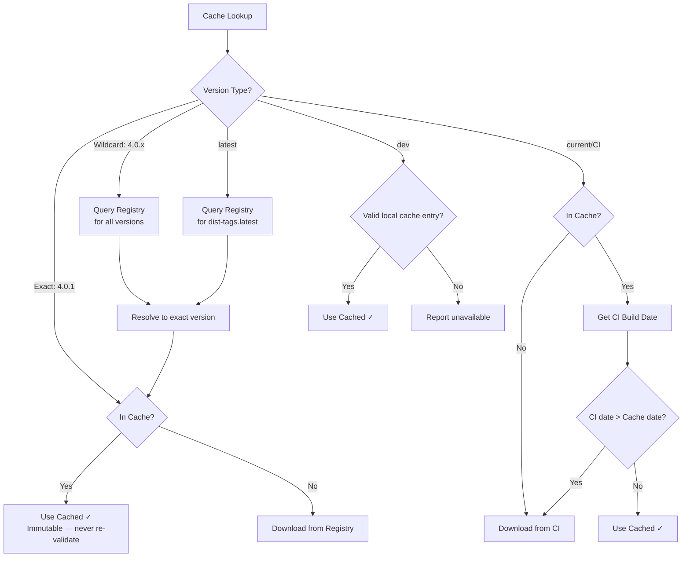
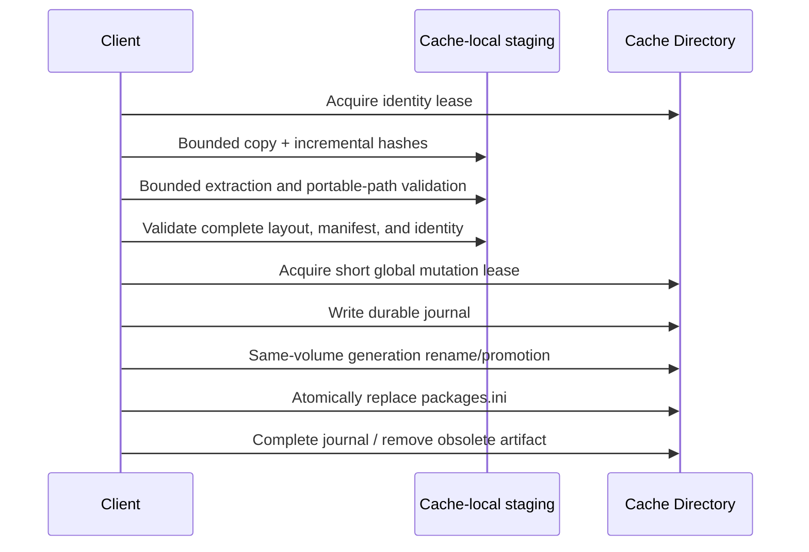

# Package Caching

FHIR packages are cached locally to avoid redundant downloads and support offline operation. This document describes the cache structure, validation strategies, and cache management.

## Cache Location

All implementations use a shared cache directory:

| Platform | Default Path |
|----------|-------------|
| Linux / macOS | `~/.fhir/packages/` |
| Windows | `%USERPROFILE%\.fhir\packages\` or `%APPDATA%\.fhir\packages\` |

> **Note:** The Java Publisher IG Loader uses `~/fhircache` (without `.fhir`) in some modes, and `%TEMP%/fhircache` for autobuild and webserver modes.

Clients may allow the cache path to be overridden via configuration or environment variables.

## Directory Structure

Each package version occupies its own directory within the cache, named with the FHIR directive format (`{name}#{version}`):

```
~/.fhir/packages/
├── packages.ini                          # Cache metadata (optional)
├── .fhirpkg/                             # FhirPkg-owned hidden state
│   ├── locks/                            # persistent identity/global/operation lock files
│   ├── staging/                          # bounded compressed and expanded operation data
│   ├── transactions/                     # durable transaction journals
│   ├── backup/                           # prior valid generations during replacement
│   └── quarantine/                       # prior corrupt artifacts during repair
├── hl7.fhir.r4.core#4.0.1/
│   └── package/
│       ├── package.json                  # Package manifest
│       ├── .index.json                   # Resource index (from publisher)
│       ├── .firely.index.json            # Extended index (Firely-generated)
│       ├── StructureDefinition-Patient.json
│       ├── ValueSet-*.json
│       └── ... (other FHIR resource files)
├── hl7.fhir.us.core#6.1.0/
│   └── package/
│       └── ...
├── hl7.fhir.us.core#current/
│   └── package/
│       └── ...
└── ...
```

**Key conventions:**

- Directory names use `#` as the separator (FHIR-style directive)
- FhirPkg uses a reversible lowercase-safe encoding when identity characters
  are unsafe for portable paths/INI keys; `PackageRecord.Reference` preserves
  the requested display identity
- All package contents reside within a `package/` subdirectory
- Only `.json` files at the `package/` level are treated as FHIR resources (not subdirectories)
- CI builds use `current` as the version component (e.g., `hl7.fhir.us.core#current`)

## Cache Metadata (`packages.ini`)

Some implementations maintain an INI-format metadata file:

```ini
[cache]
version = 3

[urls]

[local]

[packages]
hl7.fhir.r4.core#4.0.1 = 20240115120000
hl7.fhir.us.core#6.1.0 = 20240116083000
hl7.fhir.us.core#current = 20240120150000

[package-sizes]
hl7.fhir.r4.core#4.0.1 = 52428800
hl7.fhir.us.core#6.1.0 = 1048576
```

| Section | Contents |
|---------|----------|
| `[cache]` | Cache format version |
| `[packages]` | Directive → download datetime (`YYYYMMDDHHmmss`) |
| `[package-sizes]` | Directive → expanded size in bytes |
| `[package-source-publication-dates]` | Mutable-source publication timestamp |
| `[package-archive-sha256]` | SHA-256 of the installed compressed archive |

FhirPkg writes `packages.ini` atomically under the cache-wide mutation lock and
preserves unrelated/unknown sections.

## Lock File (`fhirpkg.lock.json`)

The Firely implementation uses a lock file to record resolved dependency versions:

```json
{
  "updated": "2024-01-15T10:00:00Z",
  "dependencies": {
    "hl7.fhir.r4.core": "4.0.1",
    "hl7.fhir.r4.expansions": "4.0.1",
    "hl7.fhir.us.core": "6.1.0"
  },
  "missing": {
    "some.unavailable.package": "1.0.0"
  }
}
```

## Cache Validation Strategies

Different version types require different cache validation approaches:



### Exact Versions

- **Single cache lookup** by directory name
- **Never re-validated** — published exact versions are immutable
- If not in cache, download once and store permanently

### Wildcard / Latest Versions

- **Always query the registry** to resolve to an exact version
- Wildcard literals never appear in cache directory names
- The resolved exact version is cached using its actual version number
- Example: `4.0.x` resolves to `4.0.1` → cached as `package#4.0.1`

### CI Build Versions

- **Always compare dates** with the CI build server
- Cached with the version tag (e.g., `package#current`)
- Download the CI manifest to get the current build date
- Compare against the cached `package.json` date
- Re-download if the CI build is newer

### Dev Versions

- Local-only and authoritative
- A valid local cache entry is returned even when overwrite was requested
- If not in cache, no registry or CI fallback is attempted

## Installation Process

When a package is installed through FhirPkg, it goes through these steps:



### Package Normalization

Standard archives must contain all materialized content under `package/` and
exactly one regular `package/package.json`. A narrowly defined legacy layout is
accepted only when there is one root `package.json`, no `package/` subtree or
wrapper directory, and no mixed/second manifest. Legacy normalization occurs
only after the complete archive shape has passed validation.

### Index Generation

Implementations may generate their own resource indexes on installation:

- **Firely:** Generates `.firely.index.json` with extended metadata (canonical URLs, resource types, titles, descriptions, snapshots, expansions)
- **CodeGen:** Reads the existing `.index.json` from the package
- **SUSHI:** Builds an in-memory SQLite index on load

## Resource Discovery

Clients discover resources within cached packages by:

1. **Index-based** (preferred): Read `.index.json` or `.firely.index.json` for a pre-built catalog
2. **Directory scan**: List all `.json` files in the `package/` directory (excluding subdirectories)
3. **Parse and classify**: Read each JSON file to determine its `resourceType` and metadata

## Cache Eviction

Use `IPackageCache.RemoveAsync`, `IFhirPackageManager.RemoveAsync`, or their
clear methods. These operations coordinate with installs, journal the mutation,
recover after interruption, and update metadata. Manual directory deletion is
outside the SDK coordination contract and may leave corrupt targets or stale
metadata. Persistent files under `.fhirpkg/locks` are intentionally retained.

## Concurrent Access

FhirPkg coordinates SDK users of one cache root across threads, manager/cache
instances, and processes:

- identity-specific `SemaphoreSlim` and persistent OS file locks serialize
  install, overwrite, repair, remove, and SDK reads for one canonical identity;
- unrelated identities acquire, hash, validate, and extract concurrently;
- a separate global lock covers only promotion, metadata, remove, and clear
  mutations;
- known-identity waiters revalidate after locking and return the winner without
  reading their source unless overwrite was requested;
- discovery imports may each perform bounded staging before identity is known,
  then converge after locking;
- process termination releases OS ownership; the next identity owner recovers
  its durable journal before abandoned staging cleanup; and
- `ClearAsync` has snapshot semantics, so installs begun outside its snapshot
  may finish afterward.

These guarantees apply only to SDK operations that honor `.fhirpkg/locks`.
External tools and callers directly using a previously returned raw path are
not locked. During a two-rename replacement, such a raw-path caller may briefly
observe the target absent, but never a mixed generation.

## Disk Cache vs. In-Memory Cache

### Disk Cache

The primary cache. Persists across sessions and is shared between tools:

- Location: `~/.fhir/packages/`
- Used by: All implementations
- Persistence: Until manually deleted

### In-Memory Resource Cache

An optional LRU cache for frequently accessed resources:

| Implementation | Default Size | Configuration |
|---------------|-------------|---------------|
| SUSHI/fhir-package-loader | 200 entries | `resourceCacheSize` option |
| Firely | Not built-in | — |
| CodeGen | Not built-in | — |

The SUSHI implementation supports three safety modes for the in-memory cache:

| Mode | Behavior | Performance |
|------|----------|-------------|
| `OFF` | Returns cached reference directly | Fastest — caller must not mutate |
| `CLONE` | Deep clones resources from cache | Slowest — safest for mutation |
| `FREEZE` | Recursively freezes resources | Middle — prevents accidental mutation |

### Browser Cache

The SUSHI implementation also provides a browser-compatible cache using IndexedDB:

- Each package stored as an IndexedDB object store
- Keyed by `{name}#{version}`
- Schema: `{ keyPath: ['resourceType', 'id'] }`
- Does not support `current` or `dev` versions
- Must be initialized with the full dependency list upfront
