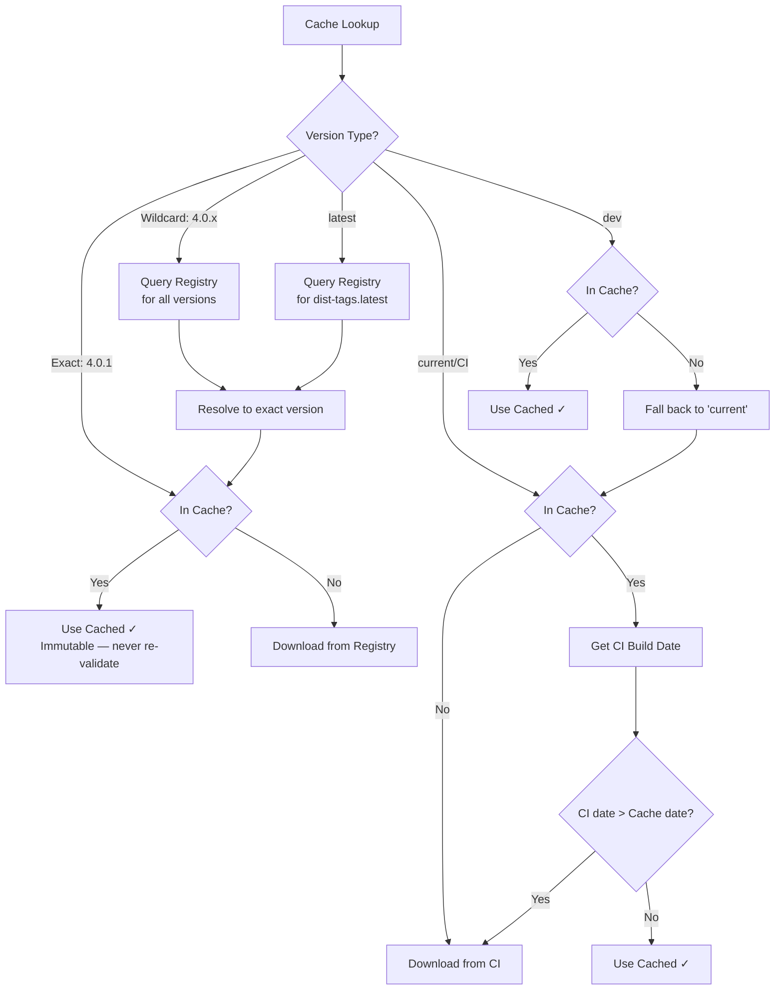
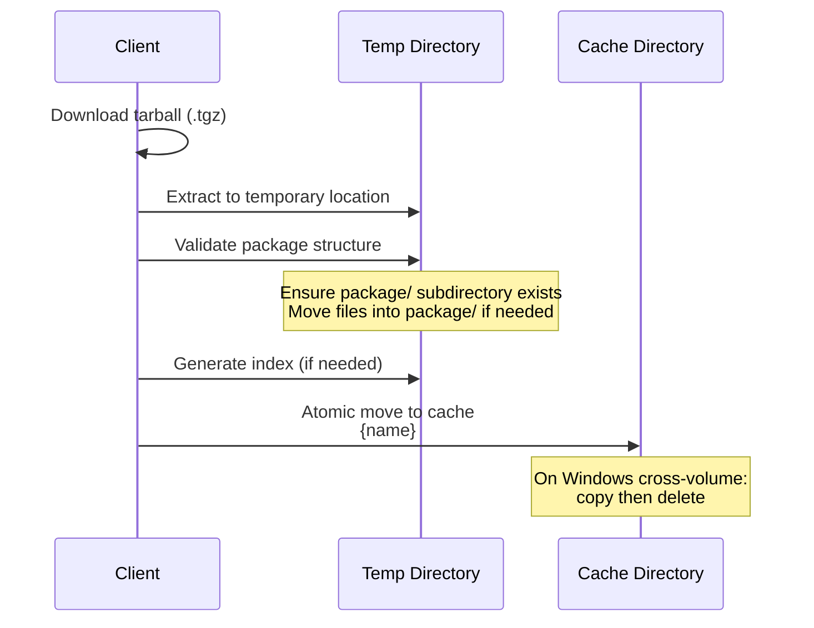

# Package Caching

FHIR packages are cached locally to avoid redundant downloads and support offline operation. This document describes the cache structure, validation strategies, and cache management.

## Cache Location

All implementations use a shared cache directory:

| Platform | Default Path |
|----------|-------------|
| Linux / macOS | `~/.fhir/packages/` |
| Windows | `%USERPROFILE%\.fhir\packages\` or `%APPDATA%\.fhir\packages\` |

> **Note:** The Java Publisher IG Loader uses `~/fhircache` (without `.fhir`) in some modes, and `%TEMP%/fhircache` for autobuild and webserver modes.

Clients may allow the cache path to be overridden via configuration or environment variables.

## Directory Structure

Each package version occupies its own directory within the cache, named with the FHIR directive format (`{name}#{version}`):

```
~/.fhir/packages/
├── packages.ini                          # Cache metadata (optional)
├── hl7.fhir.r4.core#4.0.1/
│   └── package/
│       ├── package.json                  # Package manifest
│       ├── .index.json                   # Resource index (from publisher)
│       ├── .firely.index.json            # Extended index (Firely-generated)
│       ├── StructureDefinition-Patient.json
│       ├── ValueSet-*.json
│       └── ... (other FHIR resource files)
├── hl7.fhir.us.core#6.1.0/
│   └── package/
│       └── ...
├── hl7.fhir.us.core#current/
│   └── package/
│       └── ...
└── ...
```

**Key conventions:**

- Directory names use `#` as the separator (FHIR-style directive)
- All package contents reside within a `package/` subdirectory
- Only `.json` files at the `package/` level are treated as FHIR resources (not subdirectories)
- CI builds use `current` as the version component (e.g., `hl7.fhir.us.core#current`)

## Cache Metadata (`packages.ini`)

Some implementations maintain an INI-format metadata file:

```ini
[cache]
version = 3

[urls]

[local]

[packages]
hl7.fhir.r4.core#4.0.1 = 20240115120000
hl7.fhir.us.core#6.1.0 = 20240116083000
hl7.fhir.us.core#current = 20240120150000

[package-sizes]
hl7.fhir.r4.core#4.0.1 = 52428800
hl7.fhir.us.core#6.1.0 = 1048576
```

| Section | Contents |
|---------|----------|
| `[cache]` | Cache format version |
| `[packages]` | Directive → download datetime (`YYYYMMDDHHmmss`) |
| `[package-sizes]` | Directive → expanded size in bytes |

## Lock File (`fhirpkg.lock.json`)

The Firely implementation uses a lock file to record resolved dependency versions:

```json
{
  "updated": "2024-01-15T10:00:00Z",
  "dependencies": {
    "hl7.fhir.r4.core": "4.0.1",
    "hl7.fhir.r4.expansions": "4.0.1",
    "hl7.fhir.us.core": "6.1.0"
  },
  "missing": {
    "some.unavailable.package": "1.0.0"
  }
}
```

## Cache Validation Strategies

Different version types require different cache validation approaches:



### Exact Versions

- **Single cache lookup** by directory name
- **Never re-validated** — published exact versions are immutable
- If not in cache, download once and store permanently

### Wildcard / Latest Versions

- **Always query the registry** to resolve to an exact version
- Wildcard literals never appear in cache directory names
- The resolved exact version is cached using its actual version number
- Example: `4.0.x` resolves to `4.0.1` → cached as `package#4.0.1`

### CI Build Versions

- **Always compare dates** with the CI build server
- Cached with the version tag (e.g., `package#current`)
- Download the CI manifest to get the current build date
- Compare against the cached `package.json` date
- Re-download if the CI build is newer

### Dev Versions

- Check local cache first
- If not in cache, fall back to `current` resolution (CI build)

## Installation Process

When a package is downloaded, it goes through these steps:



### Package Normalization

Some packages may not follow the expected structure (e.g., missing the `package/` subdirectory). During installation:

1. Check if `package/` directory exists
2. If not, create it and move all top-level files into `package/`
3. This handles incorrectly formatted packages

### Index Generation

Implementations may generate their own resource indexes on installation:

- **Firely:** Generates `.firely.index.json` with extended metadata (canonical URLs, resource types, titles, descriptions, snapshots, expansions)
- **CodeGen:** Reads the existing `.index.json` from the package
- **SUSHI:** Builds an in-memory SQLite index on load

## Resource Discovery

Clients discover resources within cached packages by:

1. **Index-based** (preferred): Read `.index.json` or `.firely.index.json` for a pre-built catalog
2. **Directory scan**: List all `.json` files in the `package/` directory (excluding subdirectories)
3. **Parse and classify**: Read each JSON file to determine its `resourceType` and metadata

## Cache Eviction

Packages can be removed from cache by deleting the directory:

```
rm -rf ~/.fhir/packages/hl7.fhir.us.core#6.1.0/
```

Or programmatically through the cache client's delete methods. When deleting, also update any metadata files (`packages.ini`, lock files).

## Concurrent Access

- **Thread safety:** Implementations use locks or concurrent collections for safe multi-threaded access to the package index
- **Atomic installation:** Packages are extracted to a temporary directory and then atomically moved to the cache to prevent partial installations
- **Parallel indexing:** The CodeGen implementation uses parallel processing for initial cache indexing, bounded by `ProcessorCount - 1`
- **Cross-volume awareness:** On Windows, if the temp directory and cache are on different volumes, a copy+delete is used instead of a move

## Disk Cache vs. In-Memory Cache

### Disk Cache

The primary cache. Persists across sessions and is shared between tools:

- Location: `~/.fhir/packages/`
- Used by: All implementations
- Persistence: Until manually deleted

### In-Memory Resource Cache

An optional LRU cache for frequently accessed resources:

| Implementation | Default Size | Configuration |
|---------------|-------------|---------------|
| SUSHI/fhir-package-loader | 200 entries | `resourceCacheSize` option |
| Firely | Not built-in | — |
| CodeGen | Not built-in | — |

The SUSHI implementation supports three safety modes for the in-memory cache:

| Mode | Behavior | Performance |
|------|----------|-------------|
| `OFF` | Returns cached reference directly | Fastest — caller must not mutate |
| `CLONE` | Deep clones resources from cache | Slowest — safest for mutation |
| `FREEZE` | Recursively freezes resources | Middle — prevents accidental mutation |

### Browser Cache

The SUSHI implementation also provides a browser-compatible cache using IndexedDB:

- Each package stored as an IndexedDB object store
- Keyed by `{name}#{version}`
- Schema: `{ keyPath: ['resourceType', 'id'] }`
- Does not support `current` or `dev` versions
- Must be initialized with the full dependency list upfront
