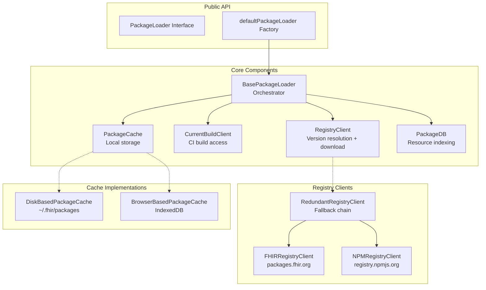
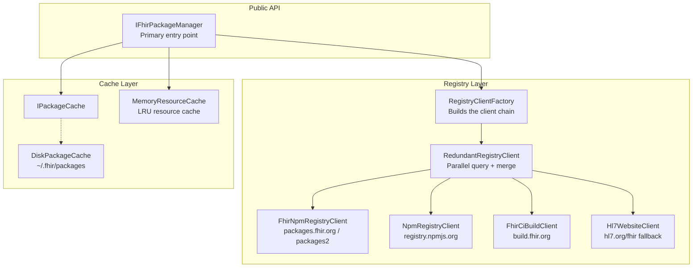
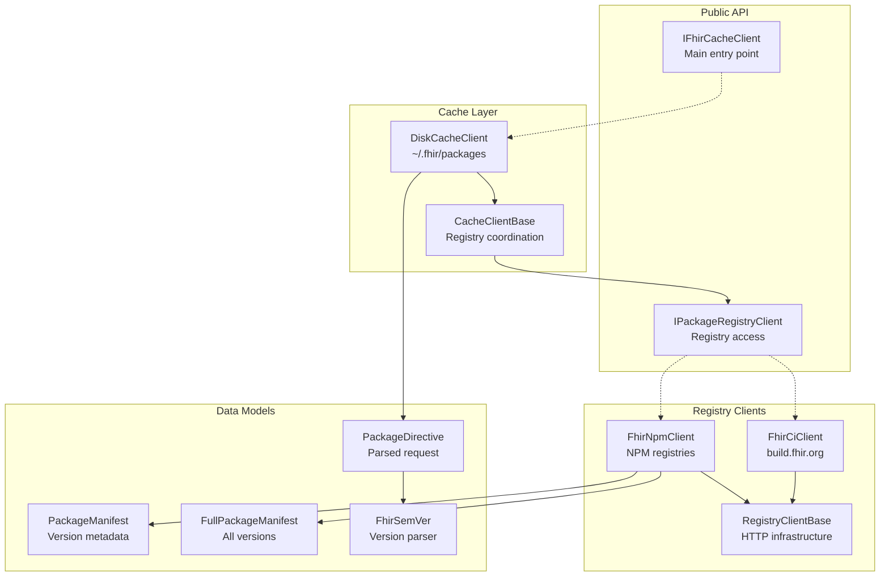
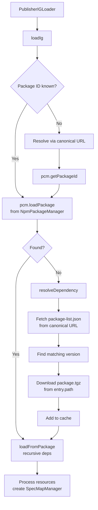

# Client Implementations

This document provides a cross-reference of the FHIR package management client implementations: their architectures, APIs, and design decisions.

> **Scope note:** Only the **FhirPkg (C#)** column and section describe this
> repository and are verified against its source. The SUSHI, Fhir.CodeGen, and
> Java Publisher entries describe third-party tools and are provided for
> comparison only — they are not verified against this codebase and may drift.

## Implementation Overview

| Feature | SUSHI (TypeScript) | FhirPkg (C#) | CodeGen (C#) | Java Publisher |
|---------|-------------------|-------------|--------------|---------------|
| **Language** | TypeScript/Node.js | C# (.NET) | C# (.NET 9) | Java |
| **Package** | `fhir-package-loader` | `fhir-pkg-lib` | `Fhir.CodeGen.Packages` | Part of IG Publisher |
| **CLI** | `fpl install` | `fhir-pkg` | N/A | Part of publisher CLI |
| **Browser Support** | Yes (IndexedDB) | No | No | No |
| **Primary Registry** | `packages.fhir.org` | `packages.fhir.org` | `packages2.fhir.org` | Via canonical URLs |
| **CI Build Support** | Yes | Yes | Yes | Yes |
| **NPM Registry Support** | Yes (configurable) | Yes | No | No |
| **Dependency Resolution** | Per-package loading | Full tree restoration | Per-directive | Recursive with fixups |

---

## SUSHI / fhir-package-loader (TypeScript)

### Architecture



### Key API

```typescript
// Create a loader with default configuration
const loader = await defaultPackageLoader({ log: console.log });

// Load a package
const status = await loader.loadPackage('hl7.fhir.us.core', '6.1.0');
// Returns: LoadStatus.LOADED | LoadStatus.NOT_LOADED | LoadStatus.FAILED

// Find resources
const infos = loader.findResourceInfos('Patient', {
  type: ['Profile'],
  scope: 'hl7.fhir.us.core|6.1.0'
});

// Find a specific resource by URL
const resource = loader.findResourceJSON(
  'http://hl7.org/fhir/us/core/StructureDefinition/us-core-patient'
);

// Load from disk (virtual package)
const virtualPkg = new DiskBasedVirtualPackage(
  { name: 'my-ig', version: '0.1.0' },
  ['./input/profiles', './input/extensions']
);
await loader.loadVirtualPackage(virtualPkg);
```

### Configuration

| Option | Default | Description |
|--------|---------|-------------|
| `log` | No-op | Logging function `(level, message) => void` |
| `resourceCacheSize` | 200 | LRU cache size (0 to disable) |
| `safeMode` | `OFF` | Resource protection: `OFF`, `CLONE`, `FREEZE` |

**Environment Variables:**

| Variable | Description |
|----------|-------------|
| `FPL_REGISTRY` | Custom NPM registry URL |
| `FPL_REGISTRY_TOKEN` | Bearer token for custom registry |
| `HTTPS_PROXY` | HTTP proxy for outbound requests |

### Default Registry Chain

1. If `FPL_REGISTRY` is set → Use NPMRegistryClient with that URL
2. Otherwise → RedundantRegistryClient fallback chain:
   - `https://packages.fhir.org` (FHIRRegistryClient)
   - `https://packages2.fhir.org/packages` (FHIRRegistryClient)

---

## FhirPkg (C#)

### Architecture



### Key API

```csharp
// Register with DI and resolve the manager
var services = new ServiceCollection();
services.AddFhirPackageManagement(options =>
{
    options.IncludeCiBuilds = true;   // CI builds are part of the default chain
    options.ConflictStrategy = ConflictResolutionStrategy.HighestWins;
});
using ServiceProvider provider = services.BuildServiceProvider();
var manager = provider.GetRequiredService<IFhirPackageManager>();

// Install a package (resolve + download + extract to the cache)
PackageRecord? record = await manager.InstallAsync("hl7.fhir.us.core#6.1.0");

// Restore all dependencies declared in a project's package.json
PackageClosure closure = await manager.RestoreAsync("./my-ig");
// closure.Resolved   — resolved packages, keyed by package id
// closure.Missing    — unresolved dependencies, keyed by package id
// closure.Failures   — structured DependencyResolutionFailure entries
// closure.IsComplete — true when Missing and Failures are both empty

// Search, then resolve without downloading
IReadOnlyList<CatalogEntry> hits =
    await manager.SearchAsync(new PackageSearchCriteria { Name = "us.core" });
ResolvedDirective? resolved = await manager.ResolveAsync("hl7.fhir.r4.core");

// Enumerate the local cache
IReadOnlyList<PackageRecord> cached = await manager.ListCachedAsync("hl7.fhir.r4");
```

### Version Resolution

Version selection happens inside `ResolveAsync`/`InstallAsync` using `FhirSemVer`
(see [Versioning](versioning.md)). Exact versions, trailing wildcards (`4.0.x`),
SemVer ranges (`^3.0.1`), alternation (`1.0.0 || 2.0.0`), and the keywords
`latest`, `current`, and `dev` are all accepted.

### Pre-configured Registries

Well-known endpoints are exposed as static `RegistryEndpoint` values, and the
default chains are assembled from them:

```csharp
RegistryEndpoint.FhirPrimary    // https://packages.fhir.org/
RegistryEndpoint.FhirSecondary  // https://packages2.fhir.org/packages
RegistryEndpoint.FhirCiBuild    // https://build.fhir.org/
RegistryEndpoint.Hl7Website     // https://hl7.org/fhir/ (core fallback)
RegistryEndpoint.NpmPublic      // https://registry.npmjs.org/

// Default chains
RegistryEndpoint.DefaultPublishedChain // Primary -> Secondary -> HL7 Website
RegistryEndpoint.DefaultFullChain      // Primary -> Secondary -> CI Build -> HL7 Website
```

---

## Fhir.CodeGen.Packages (C#)

### Architecture



### Key API

```csharp
// Create cache client with default registries
var cache = new DiskCacheClient();

// Install a package (resolves + downloads + caches)
CachedPackageRecord? record = await cache.GetOrInstallAsync(
    inputDirective: "hl7.fhir.r4.core@4.0.1",
    includeDependencies: false,
    fhirSequence: FhirReleases.FhirSequenceCodes.R4,
    overwriteExisting: false);

// Access cached package info
Console.WriteLine(record.Manifest.Name);        // "hl7.fhir.r4.core"
Console.WriteLine(record.Manifest.Version);      // "4.0.1"
Console.WriteLine(record.FullPackagePath);        // ~/.fhir/packages/hl7.fhir.r4.core#4.0.1/package

// List cached packages
var packages = await cache.ListCachedPackages(
    packageIdFilter: "hl7.fhir.r4");

// Delete a cached package
await cache.DeletePackage("hl7.fhir.r4.core#4.0.1");

// Use custom registries
var customEndpoint = new RegistryEndpointRecord {
    Url = "https://my-registry.example.com/",
    RegistryType = RegistryEndpointRecord.RegistryTypeCodes.FhirNpm,
    AuthHeaderValue = "Bearer my-token"
};

var customCache = new DiskCacheClient(
    registryEndpoints: new() { customEndpoint });
```

### Default Registry Chain

```csharp
// Queried in this order:
1. packages2.fhir.org  // Secondary (HL7 managed, richer metadata)
2. packages.fhir.org   // Primary (Firely managed)
3. build.fhir.org      // CI builds
```

### Directive Parsing

```csharp
// Supported directive formats
"hl7.fhir.r4.core#4.0.1"       → CoreFull, Exact
"hl7.fhir.r4"                   → CorePartial, Latest
"hl7.fhir.uv.ig.r4@1.x.x"     → GuideWithSuffix, Wildcard
"hl7.fhir.uv.ig@current$main"  → GuideWithoutSuffix, CiBuild
"hl7.fhir.us.core@latest"      → GuideWithoutSuffix, Latest
```

### FHIR SemVer Comparison

The CodeGen implementation includes a FHIR-aware version comparer with a pre-release tag hierarchy:

```
release > ballot > draft > snapshot > cibuild > other
```

```csharp
var v1 = FhirSemVer.Parse("1.0.0");
var v2 = FhirSemVer.Parse("1.0.0-ballot1");
// v1 > v2 (release > pre-release)

var v3 = FhirSemVer.Parse("1.0.*");
v3.Satisfies(v1); // true — wildcard matches
```

---

## Java Publisher (IG Publisher)

### Architecture

The Java implementation is embedded within the FHIR IG Publisher and uses the `NpmPackageManager` for package management.



### Key Resolution Flow

```java
// 1. Resolve package ID from canonical URL
String packageId = pf.pcm.getPackageId(canonical);

// 2. Get latest version if not specified
String version = pf.pcm.getLatestVersion(packageId);

// 3. Load package from cache/registry
NpmPackage pkg = pf.pcm.loadPackage(packageId, version);

// 4. Fallback: resolve from publication site
//    Fetches: {canonical}/package-list.json
//    Downloads: {entry.path}/package.tgz
```

### Unique Features

- **Package-list.json fallback:** Resolves packages via the IG's `package-list.json` publication manifest
- **Extension package mapping:** Automatically maps `hl7.fhir.uv.extensions` to version-specific variants
- **Version stripping:** Removes `-cibuild` suffixes
- **Custom resource approval:** Checks `igs-approved-for-custom-resource.json` from the FHIR IG registry
- **Cache-busting:** Appends `?nocache={timestamp}` to download URLs

### Cache Locations

| Mode | Path |
|------|------|
| Default | `~/fhircache` |
| Autobuild | `$TMPDIR/fhircache` |
| Webserver | `$TMPDIR/fhircache` |
| Custom | Configurable via settings |

---

## Feature Comparison Matrix

| Feature | SUSHI | FhirPkg | CodeGen | Java |
|---------|-------|--------|---------|------|
| Disk cache | ✅ | ✅ | ✅ | ✅ |
| Browser cache (IndexedDB) | ✅ | ❌ | ❌ | ❌ |
| In-memory resource cache (LRU) | ✅ | ✅ | ❌ | ❌ |
| CI build resolution | ✅ | ✅ | ✅ | ✅ |
| Branch-specific CI | ✅ | ✅ | ✅ | ❌ |
| Wildcard versions | ✅ (patch only) | ✅ (full SemVer) | ✅ (full) | ❌ |
| Version ranges | ❌ | ✅ | ❌ | ❌ |
| NPM alias support | ❌ | ✅ | ✅ | ❌ |
| NPM scoped packages | ❌ | ✅ | ❌ | ❌ |
| Custom registry auth | ✅ (env var) | ✅ (code) | ✅ (code) | ❌ |
| Proxy support | ✅ (env var) | ❌ | ❌ | ❌ |
| Virtual packages | ✅ | ❌ | ❌ | ❌ |
| Package publish | ❌ | ✅ | ❌ | ❌ |
| Lock file | ❌ | ✅ | ❌ | ❌ |
| Full dep tree restore | ❌ | ✅ | ❌ | ✅ |
| Parallel registry queries | ❌ | ✅ | ✅ | ❌ |
| Resource type indexing | ✅ (SQLite) | ✅ (.index.json) | ✅ (.index.json) | ✅ (in-memory) |
| StructureDefinition flavor | ✅ | ✅ | ❌ | ❌ |
| Shasum verification | ❌ | ✅ | ✅ | ❌ |
