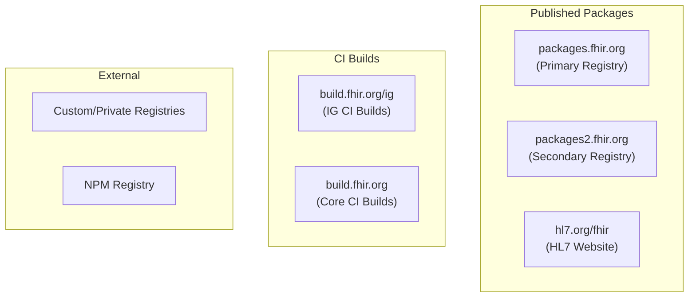
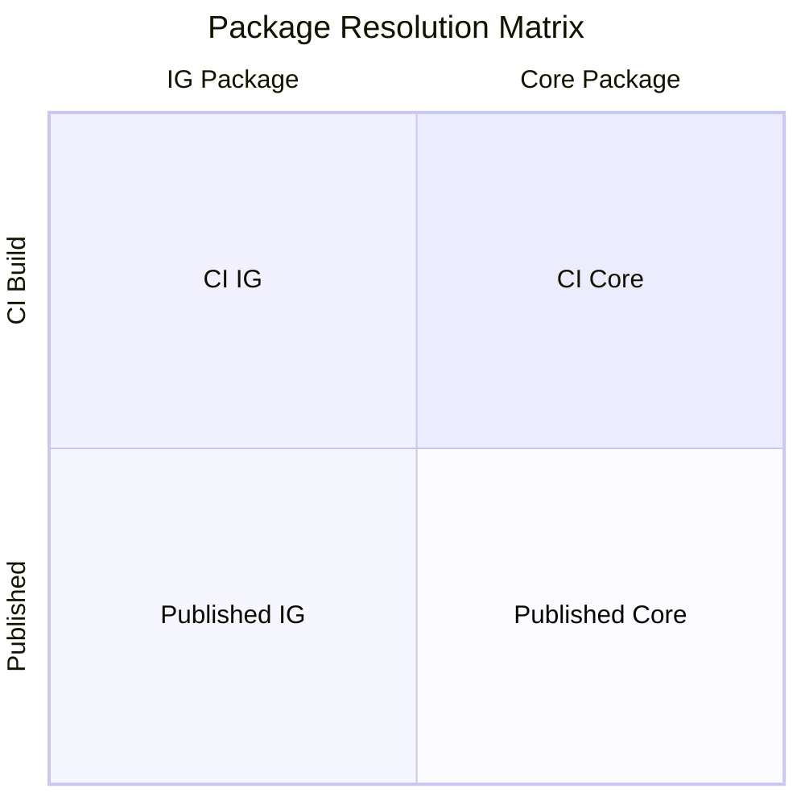

# Core Concepts

This document introduces the foundational concepts of the FHIR package ecosystem.

## What Is a FHIR Package?

A FHIR package is an NPM-compatible archive (`.tgz`) that bundles FHIR conformance resources (StructureDefinitions, ValueSets, CodeSystems, etc.) along with metadata. Packages are the primary distribution mechanism for FHIR Implementation Guides (IGs) and the FHIR specification itself.

## Package Sources

Packages originate from several sources, each with different characteristics:



### Primary Registry — `packages.fhir.org`

The primary FHIR package registry, managed by Firely under contract with HL7. Also accessible as `packages.simplifier.net`. Provides:

- Package catalog search
- NPM-compatible package listings (all versions with `dist-tags`)
- Tarball downloads

### Secondary Registry — `packages2.fhir.org`

An HL7-managed registry with enhanced metadata beyond what the primary provides:

| Extra Field | Description |
|-------------|-------------|
| `kind` | Package type: `"Core"`, `"IG"`, etc. |
| `date` | Publication timestamp (ISO 8601) |
| `count` | Number of resources in the package |
| `canonical` | Canonical URL of the IG |
| `security` | Security classification |

> **Note:** The secondary registry may have synchronization delays relative to the primary, and vice versa. Clients should query both and use the most current information.

### CI Build Server — `build.fhir.org`

Hosts continuous integration builds of IGs and FHIR core packages. CI builds:

- Are rebuilt on each commit to the source repository
- May not be stable or validated
- Use date-based freshness comparison (not version-based)
- Are indexed in `qas.json` for IG builds

### HL7 Website — `hl7.org/fhir`

The authoritative publication site for FHIR specifications. New core package releases may be available here before registries are updated. Used as a fallback source for core packages.

## Directives

A **directive** is the primary way to reference a FHIR package. It combines a package name and a version specification.

### Supported Formats

| Format | Example | Notes |
|--------|---------|-------|
| FHIR-style | `hl7.fhir.r4.core#4.0.1` | `#` separator — used in cache paths |
| NPM-style | `hl7.fhir.r4.core@4.0.1` | `@` separator — used in dependencies |
| Name only | `hl7.fhir.r4.core` | Implicitly resolves to `latest` |
| With alias | `v610@npm:hl7.fhir.us.core@6.1.0` | NPM alias for multi-version deps |

Tooling should accept both `#` and `@` as version separators. The FHIR-style (`#`) is conventional for cache directory naming, while the NPM-style (`@`) is used in `package.json` dependencies.

## Package Types

Packages fall into two broad categories based on their content:

### Core Packages

Distribute the FHIR specification itself. Always follow the naming pattern `hl7.fhir.r{N}.{type}`.

| Type | Description |
|------|-------------|
| `core` | All resources needed for conformance testing and code generation |
| `expansions` | Required-binding ValueSet expansions |
| `examples` | All resources from the FHIR specification examples |
| `search` | SearchParameter resources (uncombined for performance) |
| `corexml` | Same as `core` but resources serialized in XML |
| `elements` | StructureDefinition resources as independent data elements |

### IG Packages

Distribute Implementation Guides. Use the naming pattern `hl7.fhir.{realm}.{name}` for HL7-published IGs, or any valid NPM name for community packages.

## Resolution Dimensions

Package resolution operates along two independent dimensions:



| Dimension | Published | CI Build |
|-----------|-----------|----------|
| **IG** | Resolve via registry catalog search | Resolve via `qas.json` on `build.fhir.org` |
| **Core** | Resolve via registry or HL7 website fallback | Resolve via fixed URL patterns on `build.fhir.org` |

Each combination uses a different resolution strategy, described in detail in [Resolution](resolution.md).

## The Package Manifest (`package.json`)

Every package contains a `package.json` in its root that provides metadata:

```json
{
  "name": "hl7.fhir.us.core",
  "version": "6.1.0",
  "description": "HL7 FHIR Implementation Guide: US Core",
  "canonical": "http://hl7.org/fhir/us/core",
  "fhirVersions": ["4.0.1"],
  "dependencies": {
    "hl7.fhir.r4.core": "4.0.1",
    "hl7.fhir.r4.expansions": "4.0.1",
    "hl7.fhir.uv.extensions.r4": "1.0.0"
  },
  "author": "HL7 International / Cross-Group Projects",
  "license": "CC0-1.0",
  "type": "fhir.ig",
  "homepage": "http://hl7.org/fhir/us/core"
}
```

Key fields:

| Field | Required | Description |
|-------|----------|-------------|
| `name` | Yes | Package identifier |
| `version` | Yes | SemVer-compatible version string |
| `dependencies` | No | Map of package name → version range |
| `fhirVersions` | No | FHIR versions this package supports (array) |
| `canonical` | No | Canonical URL of the IG |
| `type` | No | Package type (`fhir.ig`, `fhir.core`, `fhir.template`, etc.) |
| `date` | No | Build date in `YYYYMMDDHHmmss` format |

## The Resource Index (`.index.json`)

Packages may include a `.index.json` file that catalogs all resources in the package for efficient lookup without parsing every file:

```json
{
  "index-version": 2,
  "date": "2024-01-15T10:00:00Z",
  "files": [
    {
      "filename": "StructureDefinition-us-core-patient.json",
      "resourceType": "StructureDefinition",
      "id": "us-core-patient",
      "url": "http://hl7.org/fhir/us/core/StructureDefinition/us-core-patient",
      "version": "6.1.0"
    }
  ]
}
```

Clients that generate their own index (e.g., Firely's `.firely.index.json`) may extend this with additional fields such as `title`, `description`, `hasSnapshot`, and `hasExpansion`.
