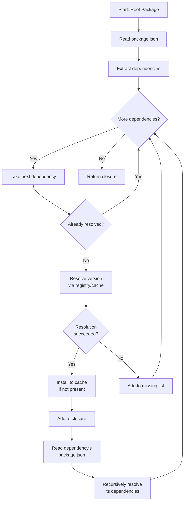
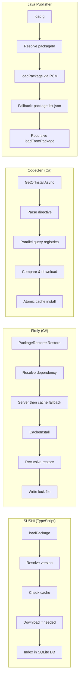

# Dependency Resolution

FHIR packages declare dependencies on other packages in their `package.json` manifest. This document describes how dependency trees are traversed and resolved.

## Dependency Declaration

Dependencies are declared in the `dependencies` field of `package.json`:

```json
{
  "name": "hl7.fhir.us.core",
  "version": "6.1.0",
  "dependencies": {
    "hl7.fhir.r4.core": "4.0.1",
    "hl7.fhir.r4.expansions": "4.0.1",
    "hl7.fhir.uv.extensions.r4": "1.0.0"
  }
}
```

Each key is a package name and each value is a version specifier. The version specifier may be:

| Format | Example | Meaning |
|--------|---------|---------|
| Exact | `"4.0.1"` | Exactly this version |
| Range | `"^3.0.1"` | SemVer-compatible range |
| Wildcard | `"4.0.x"` | Latest patch in 4.0 |
| Latest | `"latest"` | Most recent published |
| Current | `"current"` | CI build |
| Alias | `"npm:hl7.fhir.us.core@4.1.0"` | Aliased package reference |

## Resolution Algorithm

Dependency resolution is a recursive process:



### Resolution Steps

1. **Read the root manifest** — Parse `package.json` from the root package
2. **For each dependency:**
   a. Check if already in the resolution closure (prevents circular dependencies)
   b. Resolve the version (query registries, check cache)
   c. Install to cache if not present
   d. Add to closure
   e. Recursively process the dependency's own dependencies
3. **Return the closure** — A complete list of all resolved packages

### Package Closure

A package closure is the complete set of resolved transitive dependencies:

```json
{
  "updated": "2024-01-15T10:00:00Z",
  "dependencies": {
    "hl7.fhir.r4.core": "4.0.1",
    "hl7.fhir.r4.expansions": "4.0.1",
    "hl7.fhir.uv.extensions.r4": "1.0.0",
    "hl7.fhir.us.core": "6.1.0"
  },
  "missing": {}
}
```

The closure records:

- **Resolved dependencies:** Package name → exact resolved version
- **Missing dependencies:** Packages that could not be resolved
- **Completeness:** A closure is complete when there are no missing dependencies

## Circular Dependency Prevention

Before resolving each dependency, implementations check whether the package is already in the current resolution set:

```
Resolving: A → B → C → A  (circular!)
                         ↑ Already in closure — skip
```

This prevents infinite recursion. The package is simply not re-processed.

## Version Conflicts

When the dependency tree contains the same package at different versions:

```
Root
├── PackageA (depends on hl7.fhir.r4.core@4.0.1)
└── PackageB (depends on hl7.fhir.r4.core@4.0.0)
```

**Resolution strategies by implementation:**

| Implementation | Strategy |
|---------------|----------|
| Firely | Keeps the highest version (upgrades to 4.0.1) |
| SUSHI | Loads both — each package gets its resolved version |
| Java Publisher | Logs a warning about version mismatch |

## Known Package Fixups

Some implementations apply workarounds for known package issues:

### HL7 Core Package Version Fix

`hl7.fhir.r4.core@4.0.0` is automatically upgraded to `4.0.1` because the `4.0.0` publication had errors.

### Extension Package Mapping

The Java Publisher maps generic extension packages to version-specific ones:

```
hl7.fhir.uv.extensions → hl7.fhir.uv.extensions.r4   (for R4 projects)
hl7.fhir.uv.extensions → hl7.fhir.uv.extensions.r5   (for R5 projects)
```

And strips `-cibuild` suffixes from versions.

## CI Build Dependencies

When resolving dependencies for a CI build package:

- **Prefer the same organization:** If the package was built from `HL7/US-Core`, prefer CI builds from the HL7 organization
- **Date-based freshness:** Dependencies may also be CI builds — compare build dates to determine freshness
- **Non-determinism:** CI builds from different forks with the same branch name may conflict

## Implementation Comparison



### Key Differences

| Feature | SUSHI | Firely | CodeGen | Java Publisher |
|---------|-------|--------|---------|---------------|
| Dependency resolution | Manual per-load | Full recursive restore | Single-package focus | Recursive with fixups |
| Lock file | No | `fhirpkg.lock.json` | No | No |
| Version conflicts | Load both | Highest wins | Per-directive | Log warning |
| Parallel queries | Sequential with fallback | Sequential | Parallel across registries | Sequential |
| CI dep handling | Branch-aware via qas.json | Not built-in | Branch-aware via qas.json | Via canonical URL |
