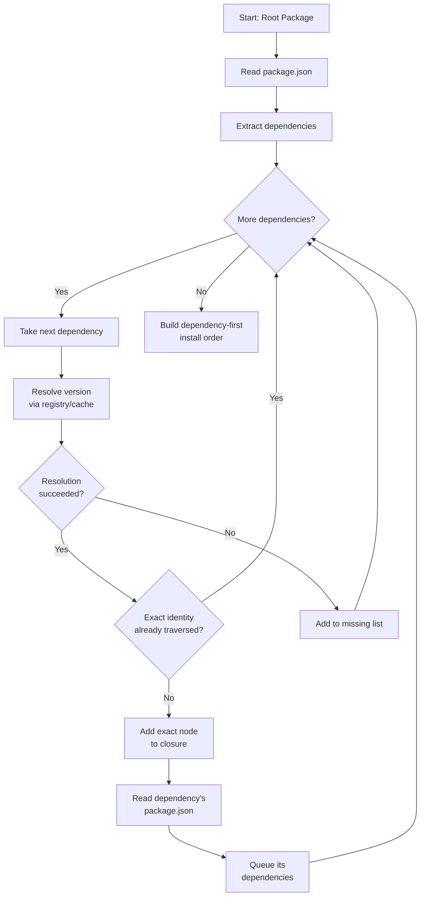
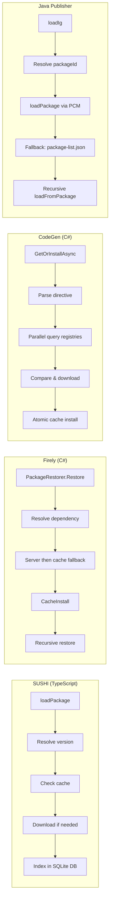

# Dependency Resolution

FHIR packages declare dependencies on other packages in their `package.json` manifest. This document describes how dependency trees are traversed and resolved.

## Dependency Declaration

Dependencies are declared in the `dependencies` field of `package.json`:

```json
{
  "name": "hl7.fhir.us.core",
  "version": "6.1.0",
  "dependencies": {
    "hl7.fhir.r4.core": "4.0.1",
    "hl7.fhir.r4.expansions": "4.0.1",
    "hl7.fhir.uv.extensions.r4": "1.0.0"
  }
}
```

Each key is a package name and each value is a version specifier. The version specifier may be:

| Format | Example | Meaning |
|--------|---------|---------|
| Exact | `"4.0"` or `"4.0.1"` | Exactly this two-part or three-part version |
| Range | `"^3.0.1"` | SemVer-compatible range |
| Wildcard | `"4.0.x"`, `"4.x?"`, `"6.0.x-*"` | Highest version matching the defined part-wise pattern |
| Latest | `"latest"` | Most recent published |
| Current | `"current"` | CI build |
| Alias | `"npm:hl7.fhir.us.core@4.1.0"` | Aliased package reference |

Two-part versions are exact, and wildcard part counts, labels, builds, and
trailing `?` follow the shared [versioning rules](versioning.md#2-part-wise-wildcard-patterns).

## Resolution Algorithm

Dependency resolution is a recursive process:


```mermaid
flowchart TD
    A[Start: Root Package] --> B[Read package.json]
    B --> C[Extract dependencies]
    C --> D{More dependencies?}
    D -->|Yes| E[Take next dependency]
    E --> G[Resolve version<br/>via registry/cache]
    G --> H{Resolution<br/>succeeded?}
    H -->|Yes| F{Exact identity<br/>already traversed?}
    F -->|Yes| D
    F -->|No| J[Add exact node<br/>to closure]
    J --> K[Read dependency's<br/>package.json]
    K --> L[Queue its<br/>dependencies]
    L --> D
    H -->|No| M[Add to missing list]
    M --> D
    D -->|No| N[Build dependency-first<br/>install order]
```

### Resolution Steps

1. **Read the root manifest** — Parse `package.json` from the root package
2. **For each in-range dependency edge:**
   a. Resolve the version through the registry policy
   b. Attach the edge to its exact package name/version node
   c. Read that exact version's registry metadata, then fall back to cache
   d. Traverse each exact node once while retaining every incoming route
   e. Keep distinct versions and their child subgraphs active
3. **Return the closure** — A complete list of all resolved packages

### Package Closure

A package closure is the complete set of resolved transitive dependencies.
Identity is package name plus exact version, so two versions of the same name
can coexist and each retains its own descendants.

The closure records:

- **Resolved packages:** Every exact name/version identity
- **Preferred projection:** Package name → the exact version selected by the
  conflict policy for convenient lookup
- **Installation identities:** Installation references, including mutable
  aliases, mapped to exact manifest identities
- **Structured failures:** Missing versions, conflicts, depth truncation,
  incomplete metadata, and registry failures
- **Missing dependencies:** A compatibility map projected from structured
  failures
- **Completeness:** A closure is complete when there are no failures

## Always-Live Restore

`RestoreAsync` reads the current project manifest and resolves the graph against
current registry/cache state on every invocation. It installs every reachable
exact identity in deterministic dependency-first order. Conflict policy changes
the preferred name-keyed projection, not which required versions are traversed
or installed.

## Circular Dependency Prevention

The resolver tracks active parent edges rather than using one global visited
set. A cycle does not expand forever, but encountering a package through one
path does not suppress a valid shared-DAG path through another parent:

```
Resolving: A → B → C → A  (circular!)
                         ↑ Already in closure — skip
```

Cycle detection is exact-version aware. Different versions of one package do
not suppress one another, and a finite exact-version cycle orders each identity
once.

## Depth Semantics

Depth is measured from the root's dependency edges:

- Direct dependencies are depth `0`.
- Their children are depth `1`.
- `MaxDepth = 0` resolves direct dependencies but reports their children as
  depth-limit failures.
- Negative values are rejected.

## Version Conflicts

When the dependency tree contains the same package at different versions:

```
Root
├── PackageA (depends on hl7.fhir.r4.core@4.0.1)
└── PackageB (depends on hl7.fhir.r4.core@4.0.0)
```

**Resolution strategies by implementation:**

| Implementation | Strategy |
|---------------|----------|
| Firely | Keeps the highest version (upgrades to 4.0.1) |
| SUSHI | Loads both — each package gets its resolved version |
| Java Publisher | Logs a warning about version mismatch |

**This SDK** keeps every required exact version and its subgraph.
`ConflictStrategy` controls only the preferred name-keyed projection:
`HighestWins` prefers the greatest semantic version, `FirstWins` prefers the
earliest traversal path (root order is significant), and `Error` uses that same
first preference while reporting a `VersionConflict` failure. The error does
not prune either exact version or its descendants.

## Known Package Fixups

This SDK applies the following fixups by default (via `PackageFixups`) before
resolution, in addition to any configured `VersionFixups`:

### HL7 Core Package Version Fix

`hl7.fhir.r4.core@4.0.0` is automatically upgraded to `4.0.1` because the `4.0.0` publication had errors.

### R4B Snapshot Alias

`hl7.fhir.r4b.core@4.3.0-snapshot1` is rewritten to `4.3.0` (the `snapshot1` pre-release aliases the release).

### Extension Package Mapping

Generic extension packages are remapped to the version-specific package for the resolved FHIR release:

```
hl7.fhir.uv.extensions → hl7.fhir.uv.extensions.r4    (R4)
hl7.fhir.uv.extensions → hl7.fhir.uv.extensions.r4b   (R4B)
hl7.fhir.uv.extensions → hl7.fhir.uv.extensions.r5    (R5)
```

And strips `-cibuild` suffixes from versions.

## CI Build Dependencies

When resolving dependencies for a CI build package:

- **Prefer the same organization:** If the package was built from `HL7/US-Core`, prefer CI builds from the HL7 organization
- **Date-based freshness:** Dependencies may also be CI builds — compare build dates to determine freshness
- **Non-determinism:** CI builds from different forks with the same branch name may conflict

## Implementation Comparison


```mermaid
flowchart LR
    subgraph SUSHI["SUSHI (TypeScript)"]
        S1[loadPackage] --> S2[Resolve version]
        S2 --> S3[Check cache]
        S3 --> S4[Download if needed]
        S4 --> S5[Index in SQLite DB]
    end

    subgraph Firely["Firely (C#)"]
        F1[PackageRestorer.Restore] --> F2[Resolve dependency]
        F2 --> F3[Server then cache fallback]
        F3 --> F4[CacheInstall]
        F4 --> F5[Recursive restore]
    end

    subgraph CodeGen["CodeGen (C#)"]
        C1[GetOrInstallAsync] --> C2[Parse directive]
        C2 --> C3[Parallel query registries]
        C3 --> C4[Compare & download]
        C4 --> C5[Atomic cache install]
    end

    subgraph Java["Java Publisher"]
        J1[loadIg] --> J2[Resolve packageId]
        J2 --> J3[loadPackage via PCM]
        J3 --> J4[Fallback: package-list.json]
        J4 --> J5[Recursive loadFromPackage]
    end
```

### Key Differences

| Feature | SUSHI | Firely | CodeGen | Java Publisher |
|---------|-------|--------|---------|---------------|
| Dependency resolution | Manual per-load | Full recursive restore | Single-package focus | Recursive with fixups |
| Project restore lock | No | Yes | No | No |
| Version conflicts | Load both | Highest wins | Per-directive | Log warning |
| Parallel queries | Sequential with fallback | Sequential | Parallel across registries | Sequential |
| CI dep handling | Branch-aware via qas.json | Not built-in | Branch-aware via qas.json | Via canonical URL |
