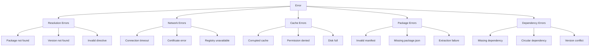
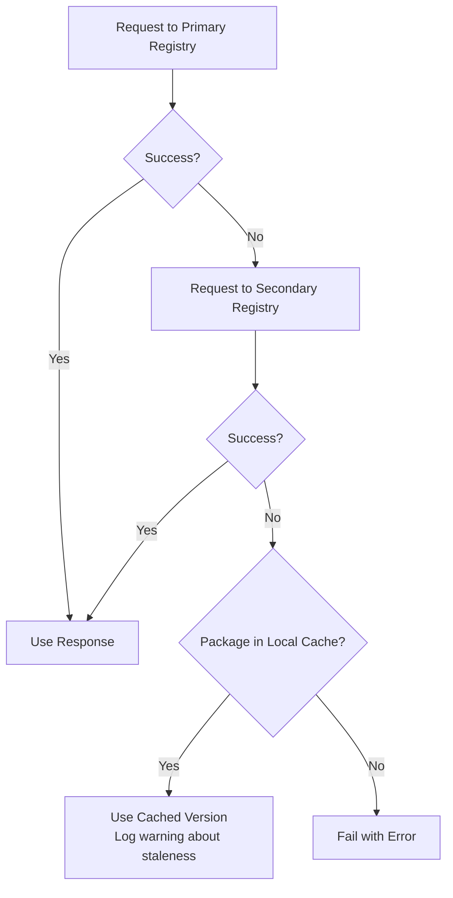

# Error Handling

This document catalogs common error scenarios in FHIR package management, their causes, and recommended handling strategies.

## Error Categories



## Resolution Errors

### Package Not Found

**Cause:** The requested package does not exist in any configured registry.

**Registry response:** HTTP 404 or empty catalog results.

**Handling:**

| Implementation | Behavior |
|---------------|----------|
| SUSHI | Returns `LoadStatus.FAILED`, logs error |
| Firely | Returns `null` from `PackageClient`, adds to `Missing` list |
| CodeGen | Returns `null` from `GetOrInstallAsync` |
| Java Publisher | Throws `FHIRException` with "Unknown Package {id}#{version}" |

**Recommended:** Check all configured registries before declaring failure. Log which registries were checked.

### Version Not Found

**Cause:** The package exists but the requested version is not available.

**Scenarios:**
- Exact version not published
- Wildcard pattern matches no versions
- Pre-release version requested but only stable versions exist

**Error types by implementation:**

```typescript
// SUSHI
throw new LatestVersionUnavailableError('hl7.fhir.us.core');
// "Latest version of hl7.fhir.us.core could not be determined from the FHIR registry"

throw new IncorrectWildcardVersionFormatError('hl7.fhir.us.core', '1.x');
// "Incorrect version format for hl7.fhir.us.core: 1.x. Use format x.y.x"
```

```csharp
// Firely — returns null, no exception
Version? resolved = versions.Resolve("99.0.x");
// resolved == null

// CodeGen — logs and returns null
// "No versions matched for directive 'pkg@99.0.x'"
```

### Invalid Directive Format

**Cause:** The input string cannot be parsed as a valid package directive.

**Examples of invalid input:**
- Empty string
- Missing package name
- Invalid characters in name
- Malformed version specifier

**Recommended:** Validate directive format before attempting resolution. Provide clear error messages indicating what's wrong.

## Network Errors

### Connection Timeout

**Cause:** Registry server is not responding within the timeout period.

**Handling:**
- Fall back to secondary registries
- Use cached version if available (even if potentially stale)
- Log warning about using cached fallback

### Certificate Errors

**Cause:** TLS certificate validation failure (self-signed certs, expired certs, corporate proxy interception).

```typescript
// SUSHI provides helpful error messages for certificate issues
if (/certificate/.test(error.message)) {
  message += '. To fix certificate issues, either:'
    + '\n  1. Set NODE_EXTRA_CA_CERTS environment variable'
    + '\n  2. Use NODE_TLS_REJECT_UNAUTHORIZED=0 (not recommended)';
}
```

**Recommended:** Never silently ignore certificate errors. Provide troubleshooting guidance.

### Registry Unavailable

**Cause:** Registry returns non-200 status codes or is completely unreachable.

**Strategy:**



## Cache Errors

### Corrupted Cache Entry

**Cause:** Interrupted download, disk error, or manual file modification.

**Symptoms:**
- Missing `package/package.json`
- Truncated or invalid JSON files
- Missing `package/` subdirectory

**Handling:**
1. Delete the corrupted cache entry
2. Re-download from registry
3. Re-extract and validate

### Permission Denied

**Cause:** Cache directory not writable (permissions, ownership, disk protection).

**Handling:**
- Log warning
- Continue without caching (download to temporary location)
- Suggest checking directory permissions

### Disk Space

**Cause:** Insufficient disk space for package extraction.

**Handling:**
- Check available space before extraction
- Clean up temporary files on failure
- Suggest cache cleanup (remove unused packages)

## Package Structure Errors

### Invalid Package Manifest

**Cause:** `package.json` is malformed, missing required fields, or contains unexpected values.

**Required fields:** `name`, `version`

```csharp
// Firely
if (manifest == null)
    throw new InvalidOperationException("Package does not have a package manifest");
```

### Missing package.json

**Cause:** The tarball doesn't contain a `package/package.json` file.

**Handling:** Some implementations attempt to normalize the package structure by moving top-level files into a `package/` directory.

### Invalid Resource Files

```typescript
// SUSHI - silently skips non-FHIR JSON files (except package.json)
catch {
  if (path.basename(resourcePath) !== 'package.json') {
    this.log('debug', `JSON file at path ${resourcePath} was not FHIR resource`);
  }
}
```

**Recommended:** Log invalid resources at debug level but don't fail the package load.

## Dependency Errors

### Missing Dependency

**Cause:** A declared dependency cannot be found in any registry.

**Handling by implementation:**

| Implementation | Behavior |
|---------------|----------|
| SUSHI | Logs error, continues with available packages |
| Firely | Adds to `PackageClosure.Missing`, throws `AggregateException` at end |
| CodeGen | Returns null for the specific package |
| Java Publisher | Logs warning, continues |

### Circular Dependencies

**Cause:** Package A depends on B, which depends on A (directly or transitively).

**Detection:** Check if a package is already in the current resolution set before processing.

**Handling:** Skip re-processing and continue. All implementations prevent infinite recursion.

### Version Conflicts

**Cause:** Different packages in the dependency tree require different versions of the same dependency.

```
Root
├── A@1.0.0 (requires C@2.0.0)
└── B@1.0.0 (requires C@3.0.0)
```

**Strategies:**
- **Highest wins** (Firely): Use version 3.0.0
- **Both loaded** (SUSHI): Each consumer gets its requested version
- **Log warning** (Java Publisher): Alert user to potential issues

## Troubleshooting Guide

### "Latest version could not be determined"

1. Check network connectivity to `packages.fhir.org`
2. Verify the package name is correct
3. Try specifying an explicit version instead of `latest`

### "Package is not available on build.fhir.org"

1. Verify the package has CI builds configured
2. Check `https://build.fhir.org/ig/qas.json` for the package
3. The source repository may not have a build pipeline

### "Certificate error" during download

1. Set `NODE_EXTRA_CA_CERTS` for Node.js environments
2. Install corporate CA certificates in the system trust store
3. Check proxy configuration (`HTTPS_PROXY`)

### Stale CI build cache

1. Delete the cached CI package: `rm -rf ~/.fhir/packages/{pkg}#current/`
2. Re-run to force a fresh download
3. If dates match but content differs, use `overwriteExisting: true`

### "Incorrect wildcard version format"

The SUSHI implementation requires patch-level wildcards (e.g., `4.0.x`). Minor-level wildcards (`4.x`) are not supported — use `latest` instead, or specify a more precise range.

### Package loads but resources are missing

1. Check if resources are in subdirectories (only top-level `.json` files are scanned)
2. Verify the `.index.json` is not stale
3. Try deleting the package from cache and re-downloading
4. Check resource file encoding (must be UTF-8)
