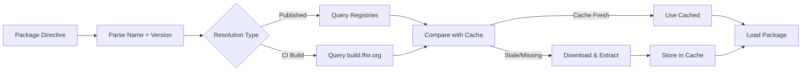

# FHIR Package Management — Developer Documentation

This documentation covers the FHIR package ecosystem: how packages are named, versioned, discovered, resolved, cached, and served. It is intended for developers building or maintaining tools that interact with FHIR package registries.

## Contents

| Document | Description |
|----------|-------------|
| [Core Concepts](concepts.md) | Packages, registries, directives, and package types |
| [Package Naming](package-naming.md) | Naming conventions, segment patterns, and special forms |
| [Versioning](versioning.md) | Version formats, wildcards, tags, and comparison rules |
| [Resolution](resolution.md) | How packages are resolved from directives to tarballs |
| [Registry API](registry-api.md) | Server endpoints, request/response formats, and examples |
| [Caching](caching.md) | Local package cache structure, validation, and invalidation |
| [Dependencies](dependencies.md) | Dependency trees, lock files, and circular dependency handling |
| [Client Implementations](client-implementations.md) | Reference implementations in TypeScript, C#, and Java |
| [Security](security.md) | Authentication, integrity verification, and transport security |
| [Error Handling](errors.md) | Common errors, failure modes, and troubleshooting |

## Quick Overview

FHIR packages follow an NPM-compatible packaging format (`.tgz` tarballs containing a `package/` directory with a `package.json` manifest). They are published to FHIR-specific registries and resolved through a multi-source strategy that considers published releases, CI builds, and local caches.



## Registries

| Registry | URL | Managed By | Notes |
|----------|-----|------------|-------|
| Primary | `packages.fhir.org` | Firely (under HL7 contract) | Alias: `packages.simplifier.net` |
| Secondary | `packages2.fhir.org` | HL7 | Extended metadata (`kind`, `date`, `count`) |
| CI Builds | `build.fhir.org` | HL7 | Continuous integration builds |
| HL7 Website | `hl7.org/fhir` | HL7 | Authoritative source for new core releases |

## Package Format

Every FHIR package is a gzip-compressed tar archive with this structure:

```
package.tgz
└── package/
    ├── package.json          # NPM-compatible manifest
    ├── .index.json           # Resource index (optional)
    ├── StructureDefinition-*.json
    ├── ValueSet-*.json
    ├── CodeSystem-*.json
    └── ... (other FHIR resources)
```
