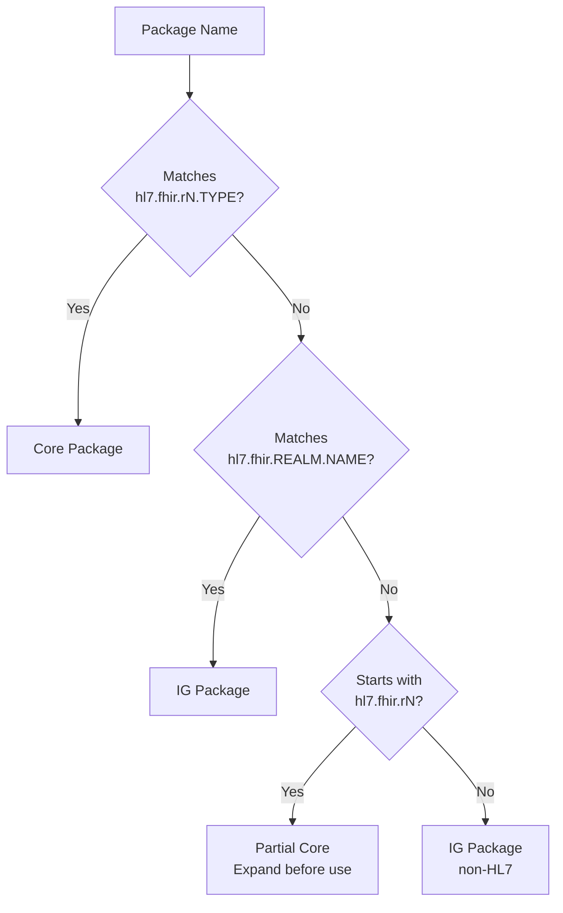

# Package Naming

FHIR packages follow structured naming conventions that encode information about package type, FHIR version, and realm.

## Naming Patterns

### Core Packages

Core packages distribute the FHIR specification itself. They always follow a four-segment pattern:

```
hl7.fhir.r{version}.{type}
```

| Segment | Value | Description |
|---------|-------|-------------|
| 1 | `hl7` | Organization (literal) |
| 2 | `fhir` | Standard (literal) |
| 3 | `r{N}` | Release identifier: `r2`, `r3`, `r4`, `r4b`, `r5`, `r6` |
| 4 | `{type}` | Package type: `core`, `expansions`, `examples`, `search`, `corexml`, `elements` |

**Examples:**

```
hl7.fhir.r4.core          # R4 conformance resources
hl7.fhir.r5.expansions    # R5 ValueSet expansions
hl7.fhir.r6.examples      # R6 specification examples
hl7.fhir.r4.corexml       # R4 resources in XML format
```

### Partial Core Names

Users may specify core packages with only three segments as a shorthand:

```
hl7.fhir.r{version}
```

**Example:** `hl7.fhir.r4`

This is **not** a valid package name for download or caching. It must be expanded to full names before resolution. The standard expansion maps to at minimum:

- `hl7.fhir.r{N}.core`
- `hl7.fhir.r{N}.expansions`

Additional packages (`examples`, `search`, `corexml`, `elements`) are optionally included depending on the tooling context.

### IG Packages — Without FHIR Version Suffix

The standard naming pattern for Implementation Guide packages:

```
{scope}.fhir.{realm}.{name}
```

For HL7 packages:

```
hl7.fhir.{realm}.{name}
```

| Segment | Description | Examples |
|---------|-------------|----------|
| `scope` | Publishing organization | `hl7`, `ihe`, `who` |
| `fhir` | Standard (literal) | |
| `realm` | Jurisdictional realm | `uv` (universal), `us`, `au`, `eu` |
| `name` | Package name (may contain dots) | `core`, `subscriptions-backport` |

**Examples:**

```
hl7.fhir.uv.extensions     # HL7 Universal Extensions
hl7.fhir.us.core           # US Core
hl7.fhir.au.base           # AU Base
ihe.formatcode.fhir        # IHE Format Code (non-HL7)
```

### IG Packages — With FHIR Version Suffix

When an IG supports multiple FHIR versions, publication tooling generates version-specific variant packages:

```
{scope}.fhir.{realm}.{name}.r{fhirVersion}
```

**Examples:**

```
hl7.fhir.uv.extensions.r4    # Extensions for R4
hl7.fhir.uv.extensions.r4b   # Extensions for R4B
hl7.fhir.uv.extensions.r5    # Extensions for R5
```

**Rules:**

- The root package name (without suffix) is assigned to the **highest** supported FHIR version
- Lower FHIR versions get explicit suffixes
- These suffixed packages are auto-generated by publication tooling
- Not all IGs have suffixed variants — only multi-version IGs

### Non-HL7 Packages

Community and third-party packages may use any valid NPM name. They are always treated as IG packages (never core). Examples:

```
us.nlm.vsac
us.cdc.phinvads
```

## Determining Package Type from Name

Clients can determine whether a package is Core or IG by inspecting the name:



The secondary registry (`packages2.fhir.org`) also provides a `kind` field in catalog responses that explicitly indicates `"Core"` or `"IG"`.

## NPM Alias Support

Package references in `dependencies` may use NPM alias syntax to include multiple versions of the same package:

```json
{
  "dependencies": {
    "hl7.fhir.us.core": "6.1.0",
    "v410@npm:hl7.fhir.us.core": "4.1.0"
  }
}
```

| Format | Example |
|--------|---------|
| Standard | `"hl7.fhir.us.core": "6.1.0"` |
| With alias (`@`) | `"v410@npm:hl7.fhir.us.core@4.1.0"` |
| With alias (`#`) | `"v410@npm:hl7.fhir.us.core#4.1.0"` |

> **Note:** NPM scopes (e.g., `@hl7/fhir-r4`) are not commonly used in the HL7 ecosystem but may appear in third-party packages. Clients should support scoped package names.

## Core Package Types Reference

| Type | Available Since | Description |
|------|----------------|-------------|
| `core` | R4 Ballot | All conformance resources for testing and code generation |
| `expansions` | R4 Ballot | Required-binding ValueSet expansions |
| `examples` | R4 | All FHIR specification example resources |
| `search` | R4 | SearchParameter resources (uncombined) |
| `corexml` | R5 | Core resources serialized in XML |
| `elements` | R5 | StructureDefinitions as independent data elements |

## Determining FHIR Version from Package

When a package manifest doesn't explicitly include `fhirVersions`, the FHIR version can be inferred from dependencies:

```json
{
  "dependencies": {
    "hl7.fhir.r4.core": "4.0.1"
  }
}
```

A dependency on `hl7.fhir.r4.core` implies the package targets FHIR R4 (version `4.0.1`). This fallback is used by several implementations when the `fhirVersions` field is absent.
