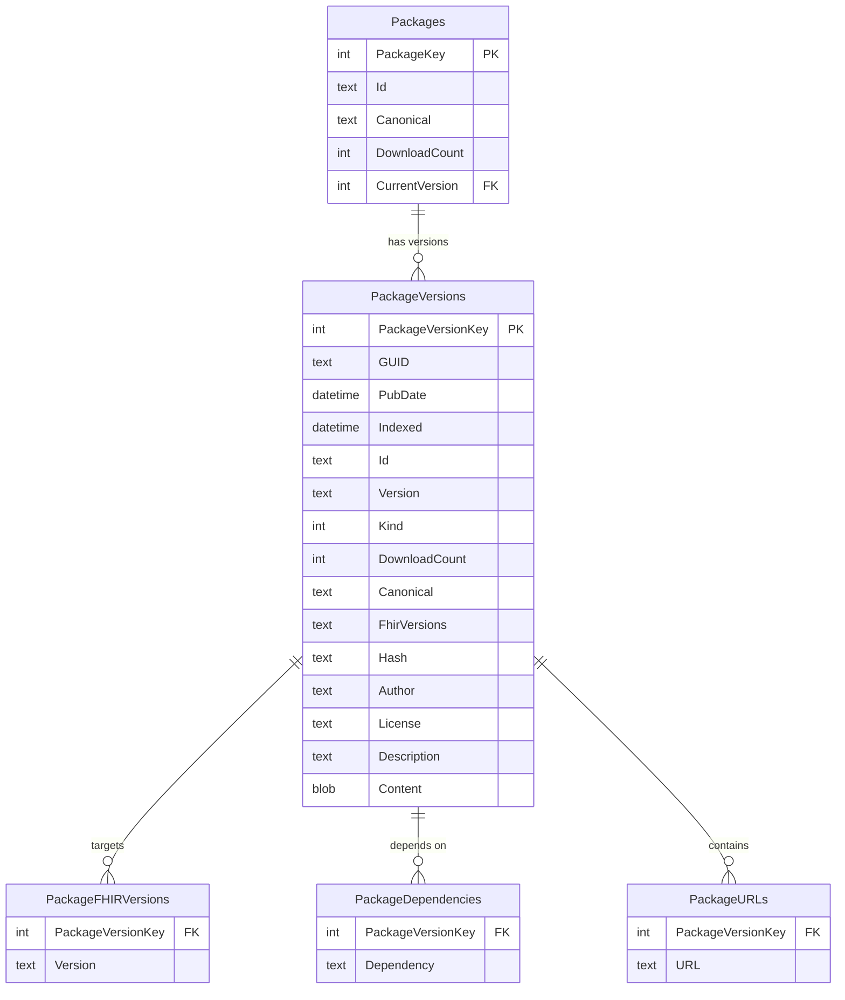

# Registry API Reference

This document covers the FHIR package registry server API, including all endpoints, request parameters, response formats, and examples.

<!-- Validated: 2026-03-09 via live curl requests against production registries -->

## API Overview

The FHIR package server exposes an NPM-compatible API with FHIR-specific extensions. All data is served over HTTPS.

### Base URLs

| Registry | Base URL |
|----------|----------|
| Primary (Firely) | `https://packages.fhir.org` |
| Secondary (HL7) | `https://packages2.fhir.org/packages` |

> **Note:** The primary registry is also accessible as `packages.simplifier.net`. Tarball download URLs returned by the primary registry use the `packages.simplifier.net` hostname.

## Endpoints

### Package Catalog Search

Search for packages across the registry.

<!-- ✅ VALIDATED: Primary catalog works as documented.
     ⚠️ VALIDATED: Secondary catalog does NOT accept the `op=find` parameter — omit it. -->

**Primary registry:**

```
GET /catalog?op=find&name={name}&pkgcanonical={canonical}&canonical={canonical}&fhirversion={fhirversion}
```

**Secondary registry (different parameter format — no `op` parameter):**

```
GET /catalog?name={name}&pkgcanonical={canonical}&canonical={canonical}&fhirversion={fhirversion}
```

**Parameters:**

| Parameter | Type | Max Length | Pattern | Description |
|-----------|------|-----------|---------|-------------|
| `op` | String | — | `find` | **Primary registry only.** Operation type. |
| `name` | String | 100 | `[a-zA-Z0-9._#-]*` | Package ID, or `id#version` for versioned search |
| `pkgcanonical` | String | 200 | `[a-zA-Z0-9._:/-]*%?` | Package canonical URL. Append `%` for prefix match |
| `canonical` | String | 200 | `[a-zA-Z0-9._:/-]*` | Resource canonical URL contained in the package |
| `fhirversion` | String | 10 | `R2\|R3\|R4\|R4B\|R5\|R6` | FHIR version filter |
| `dependency` | String | 100 | `[a-zA-Z0-9._#\|-]*` | Filter by specific dependency |
| `sort` | String | 20 | see below | Sort field |

**Sort options:** `name`, `version`, `date`, `count`, `fhirversion`, `kind`, `canonical`. Prefix with `-` for descending (e.g., `-date`).

**Example Request (primary):**

```http
GET https://packages.fhir.org/catalog?op=find&name=hl7.fhir.us.core&fhirversion=R4
```

<!-- ✅ VALIDATED 2026-03-09: Returns JSON array with PascalCase keys. Includes the root package
     plus variant packages (.v311, .v610, .3.1.1, .r4, .v700). -->

**Response — Primary Registry:**

```json
[
  {
    "Name": "hl7.fhir.us.core",
    "Description": "HL7 FHIR Implementation Guide: US Core ...",
    "FhirVersion": "R4"
  },
  {
    "Name": "hl7.fhir.us.core.v311",
    "Description": null,
    "FhirVersion": "R4"
  },
  {
    "Name": "hl7.fhir.us.core.r4",
    "Description": "HL7 FHIR Implementation Guide: US Core ...",
    "FhirVersion": "R4"
  }
]
```

> **Note:** The primary registry uses PascalCase property names (`Name`, `Description`, `FhirVersion`). Clients should handle both PascalCase and camelCase. The response includes all related packages (version-suffixed variants, FHIR-version variants, etc.).

**Example Request (secondary):**

```http
GET https://packages2.fhir.org/packages/catalog?name=hl7.fhir.us.core&fhirversion=R4
```

<!-- ✅ VALIDATED 2026-03-09: Returns JSON array with camelCase keys. Fields include:
     name, version, fhirVersion, canonical, kind, url, date. Some entries also include description.
     Does NOT include count or security in catalog results. -->

**Response — Secondary Registry:**

```json
[
  {
    "name": "hl7.fhir.us.core.v311",
    "version": "3.1.1",
    "fhirVersion": "4.0.1",
    "canonical": "http://hl7.org/fhir/us/core/v311",
    "kind": "fhir.ig",
    "url": "https://packages2.fhir.org/web/hl7.fhir.us.core.v311-3.1.1.tgz",
    "date": "2024-09-05T12:00:44Z"
  },
  {
    "name": "hl7.fhir.us.core.r4",
    "version": "8.0.0",
    "fhirVersion": "4.0.1",
    "canonical": "http://hl7.org/fhir/us/core",
    "kind": "fhir.ig",
    "url": "https://packages2.fhir.org/web/hl7.fhir.us.core.r4-8.0.0.tgz",
    "date": "2025-10-29T00:03:08Z",
    "description": "HL7 FHIR Implementation Guide: US Core ..."
  }
]
```

> **Note:** The secondary registry uses camelCase keys and returns `fhirVersion` as a literal version string (e.g., `"4.0.1"`) rather than a release label (e.g., `"R4"`). The `description` field is present only on some entries. The `url` field points to a tarball on the secondary registry's own CDN.

---

### Package Listing (NPM Registry Format)

Get all versions of a specific package.

```
GET /{package-name}
```

**Example Request:**

```http
GET https://packages.fhir.org/hl7.fhir.us.core
```

<!-- ✅ VALIDATED 2026-03-09: Structure confirmed. Key differences from original doc:
     - dist-tags.latest is dynamic (was 8.0.1 at time of validation)
     - Tarball URLs point to packages.simplifier.net, NOT packages.fhir.org
     - Version objects contain: name, version, description, dist{shasum,tarball}, fhirVersion, url
     - No dependencies included in version objects on primary -->

**Response (primary registry):**

```json
{
  "_id": "hl7.fhir.us.core",
  "name": "hl7.fhir.us.core",
  "description": "HL7 FHIR Implementation Guide: US Core ...",
  "dist-tags": {
    "latest": "8.0.1"
  },
  "versions": {
    "0.0.0": {
      "name": "hl7.fhir.us.core",
      "version": "0.0.0",
      "description": "None.",
      "dist": {
        "shasum": "716320373f2ad6a73c544e9faf162518e107104d",
        "tarball": "https://packages.simplifier.net/hl7.fhir.us.core/0.0.0"
      },
      "fhirVersion": "STU3",
      "url": "https://packages.simplifier.net/hl7.fhir.us.core/0.0.0"
    },
    "6.1.0": {
      "name": "hl7.fhir.us.core",
      "version": "6.1.0",
      "description": "None.",
      "dist": {
        "shasum": "...",
        "tarball": "https://packages.simplifier.net/hl7.fhir.us.core/6.1.0"
      },
      "fhirVersion": "R4",
      "url": "https://packages.simplifier.net/hl7.fhir.us.core/6.1.0"
    }
  }
}
```

> **Note:** Tarball URLs in the primary registry point to `packages.simplifier.net`, not `packages.fhir.org`. Clients should follow the URL as-is rather than constructing download URLs independently.

<!-- ✅ VALIDATED 2026-03-09: Secondary listing confirmed. Includes extra fields per version:
     _id (version-specific), date, fhirVersion (literal), kind, count, canonical, url,
     homepage, license. Tarball URLs point to packages2.fhir.org/web/.
     dist-tags.latest may differ from primary registry. -->

**Response (secondary registry — enhanced metadata):**

```json
{
  "_id": "hl7.fhir.us.core",
  "name": "hl7.fhir.us.core",
  "description": "HL7 FHIR Implementation Guide: US Core ...",
  "dist-tags": {
    "latest": "9.0.0-ballot"
  },
  "versions": {
    "0.0.0": {
      "name": "hl7.fhir.us.core",
      "_id": "hl7.fhir.us.core@1.8.0",
      "version": "0.0.0",
      "date": "2016-12-06T12:00:00Z",
      "fhirVersion": "1.8.0",
      "kind": "fhir.ig",
      "count": 0,
      "canonical": "http://hl7.org/fhir/us/core",
      "url": "https://packages2.fhir.org/web/hl7.fhir.us.core-0.0.0.tgz",
      "dist": {
        "shasum": "4febc68600e115586735840a89380d8d9a81b0c5",
        "tarball": "https://packages2.fhir.org/web/hl7.fhir.us.core-0.0.0.tgz"
      },
      "homepage": "http://hl7.org/fhir/us/core/2017Jan",
      "license": "CC0-1.0",
      "description": "HL7 FHIR Implementation Guide: US Core ..."
    }
  }
}
```

**Secondary registry version fields (additional to primary):**

| Field | Type | Description |
|-------|------|-------------|
| `_id` | String | Version-specific identifier (`name@fhirVersion`) |
| `date` | String (ISO 8601) | Publication timestamp |
| `kind` | String | `"fhir.core"`, `"fhir.ig"`, `"fhir.template"` |
| `count` | Integer | Number of resources in the package |
| `canonical` | String | IG canonical URL |
| `url` | String | Direct download URL on secondary CDN |
| `homepage` | String | Publication homepage URL |
| `license` | String | License identifier (e.g., `"CC0-1.0"`) |

<!-- ⚠️ MANUAL REVIEW: The primary and secondary registries may report different `dist-tags.latest`
     values. At time of validation, primary reported 8.0.1 and secondary reported 9.0.0-ballot.
     The secondary may include pre-release versions in its "latest" tag. -->

---

### Package Download

Download a specific version as a tarball.

```
GET /{package-name}/{version}
```

**Example Request:**

```http
GET https://packages.fhir.org/hl7.fhir.us.core/6.1.0
```

<!-- ✅ VALIDATED 2026-03-09: Returns HTTP 200 with content-type: application/tar+gzip.
     Size ~1.6MB. HEAD requests return 405 Method Not Allowed on the primary registry. -->

**Response:**

- **Content-Type:** `application/tar+gzip`
- **Body:** gzip-compressed tar archive

> **Note:** The primary registry returns `application/tar+gzip` as the content type (not `application/gzip`). HEAD requests are not supported (returns 405 Method Not Allowed).

The tarball contains a `package/` directory with:

```
package/
├── package.json
├── .index.json
├── StructureDefinition-us-core-patient.json
├── ValueSet-us-core-observation-smoking-status.json
└── ... (other FHIR resources)
```

<!-- ✅ VALIDATED 2026-03-09: Primary returns empty body on 404.
     Secondary returns plain text: 'The package "name#version" is not known by this server'. -->

**Error Response (404):**

The error format differs between registries:

- **Primary registry:** Returns HTTP 404 with an empty body.
- **Secondary registry:** Returns HTTP 404 with plain text body:

```
The package "nonexistent.package.xyz#1.0.0" is not known by this server
```

---

### NPM v1 Search API

NPM-compatible search endpoint. Available on the secondary registry.

```
GET /-/v1/search?name={name}&fhirversion={fhirversion}
```

<!-- ⚠️ VALIDATED 2026-03-09: The response is a FLAT JSON array — it is NOT wrapped in
     {objects:[{package:{}}]} as the NPM v1 spec would suggest. The response format is
     identical to the /catalog endpoint. This may be a MANUAL REVIEW item if the server
     is expected to follow npm search spec. -->

**Response:**

> **⚠️ Differs from NPM spec:** Despite the NPM-style URL path, this endpoint returns a flat JSON array (same format as the `/catalog` endpoint), **not** the `{objects: [{package: {}}]}` wrapper that the NPM v1 search API specifies.

```json
[
  {
    "name": "hl7.fhir.us.core.v311",
    "version": "3.1.1",
    "fhirVersion": "4.0.1",
    "canonical": "http://hl7.org/fhir/us/core/v311",
    "kind": "fhir.ig",
    "url": "https://packages2.fhir.org/web/hl7.fhir.us.core.v311-3.1.1.tgz",
    "date": "2024-09-05T12:00:44.000Z"
  },
  {
    "name": "hl7.fhir.us.core.r4",
    "version": "8.0.0",
    "fhirVersion": "4.0.1",
    "canonical": "http://hl7.org/fhir/us/core",
    "kind": "fhir.ig",
    "url": "https://packages2.fhir.org/web/hl7.fhir.us.core.r4-8.0.0.tgz",
    "date": "2025-10-29T00:03:08.000Z",
    "description": "HL7 FHIR Implementation Guide: US Core ..."
  }
]
```

---

### Package Updates

Get packages updated since a specific date. Available on the secondary registry.

```
GET /updates?dateType={relative|absolute}&daysValue={N}&dateValue={ISO-date}
```

**Parameters:**

| Parameter | Description |
|-----------|-------------|
| `dateType` | `relative` (days ago) or `absolute` (specific date) |
| `daysValue` | Number of days ago (when `dateType=relative`) |
| `dateValue` | ISO 8601 date (when `dateType=absolute`) |

**Example:**

```http
GET https://packages2.fhir.org/packages/updates?dateType=relative&daysValue=7
```

<!-- ✅ VALIDATED 2026-03-09: Returns JSON array of recently updated packages.
     Each entry has: name, date, version, canonical, fhirVersion, description, kind, url. -->

**Response:**

```json
[
  {
    "name": "de.gematik.dipag",
    "date": "2026-03-07T11:43:43.000Z",
    "version": "1.0.4",
    "canonical": "http://simplifier.net/packages/de.gematik.dipag",
    "fhirVersion": "4.0.1",
    "description": "...",
    "kind": "fhir.ig",
    "url": "https://packages2.fhir.org/web/de.gematik.dipag-1.0.4.tgz"
  }
]
```

---

### Server Statistics

```
GET /stats
```

<!-- ⚠️ VALIDATED 2026-03-09: Endpoint timed out after 15 seconds. May be a long-running query
     or may require specific conditions. Verify availability. -->

Returns database and crawler metrics including package counts, version counts, and download statistics. This endpoint may be slow to respond on large registries.

---

### Broken Dependencies Report

```
GET /broken?filter={package-name}
```

Returns packages with unresolvable dependencies. Optionally filter by package name.

---

## CI Build Endpoints

The CI build server at `build.fhir.org` provides access to continuous integration builds.

### QA Index (IG Builds)

```
GET https://build.fhir.org/ig/qas.json
```

<!-- ✅ VALIDATED 2026-03-09: Confirmed. Response has MORE fields than originally documented.
     Additional fields: url (full canonical), title, description, ig-date, status,
     suppressed-hints, suppressed-warnings, tool, maxMemory.
     The repo field uses format: {org}/{repo}/branches/{branch}/qa.json for branch builds,
     or {org}/{repo}/{branch}/qa.json for default branches. -->

**Response:**

```json
[
  {
    "url": "http://hl7.org/fhir/us/core/ImplementationGuide/hl7.fhir.us.core",
    "name": "USCore",
    "title": "US Core Implementation Guide",
    "description": "The US Core Implementation Guide ...",
    "ig-date": "2025-09-24",
    "status": "active",
    "package-id": "hl7.fhir.us.core",
    "ig-ver": "9.0.0-ballot",
    "date": "Fri, 12 Dec, 2025 13:21:06 +0000",
    "dateISO8601": "2025-12-12T07:21:06-06:00",
    "errs": 3,
    "warnings": 0,
    "hints": 0,
    "suppressed-hints": 424,
    "suppressed-warnings": 60,
    "version": "4.0.1",
    "tool": "5.0.0 (3)",
    "maxMemory": 18096973104,
    "repo": "HL7/US-Core/branches/9.0.0-ballot/qa.json"
  }
]
```

| Field | Description |
|-------|-------------|
| `url` | Canonical URL of the IG (full ImplementationGuide canonical) |
| `name` | IG name (short identifier) |
| `title` | Human-readable IG title |
| `description` | Full IG description |
| `ig-date` | IG publication date (from the IG resource) |
| `status` | IG status (e.g., `"active"`, `"draft"`) |
| `package-id` | Package identifier |
| `ig-ver` | IG version string |
| `date` | Build date (human-readable, format: `ddd, DD MMM, YYYY HH:mm:ss +ZZZZ`) |
| `dateISO8601` | Build date (ISO 8601) |
| `version` | FHIR version (literal, e.g., `"4.0.1"`) |
| `repo` | GitHub `{org}/{repo}/branches/{branch}/qa.json` path |
| `tool` | IG Publisher tool version |
| `errs`, `warnings`, `hints` | Build quality metrics |
| `suppressed-hints`, `suppressed-warnings` | Suppressed quality metrics |
| `maxMemory` | Peak memory usage during build (bytes) |

### IG Package Download

```
GET https://build.fhir.org/ig/{org}/{repo}/package.tgz
GET https://build.fhir.org/ig/{org}/{repo}/branches/{branch}/package.tgz
GET https://build.fhir.org/ig/{org}/{repo}/package.r4.tgz
```

### IG Package Manifest

```
GET https://build.fhir.org/ig/{org}/{repo}/package.manifest.json
```

<!-- ✅ VALIDATED 2026-03-09: Confirmed. Key differences from original doc:
     - fhirVersion is an ARRAY, not a string: ["4.0.1"]
     - Includes jurisdiction field
     - No url field in the manifest
     - date format confirmed as YYYYMMDDHHmmss -->

**Response:**

```json
{
  "version": "9.0.0",
  "fhirVersion": ["4.0.1"],
  "date": "20260307214546",
  "name": "hl7.fhir.us.core",
  "jurisdiction": "urn:iso:std:iso:3166#US"
}
```

> **Note:** The `fhirVersion` field is an **array** of strings, not a single string. The `date` field uses the `YYYYMMDDHHmmss` format. The manifest may include a `jurisdiction` field. There is no `url` field in the manifest (unlike the `qas.json` index).

### Core Package Download

```
GET https://build.fhir.org/{package-name}.tgz
GET https://build.fhir.org/branches/{branch}/{package-name}.tgz
```

<!-- ✅ VALIDATED 2026-03-09: Returns 200 with content-type: application/gzip -->

**Examples:**

```http
GET https://build.fhir.org/hl7.fhir.r6.core.tgz
GET https://build.fhir.org/branches/R5/hl7.fhir.r5.core.tgz
```

### Core Package Manifest

```
GET https://build.fhir.org/{package-name}.manifest.json
```

<!-- ✅ VALIDATED 2026-03-09: Returns JSON with same format as IG manifest.
     fhirVersion is an array. -->

**Response:**

```json
{
  "version": "6.0.0-ballot4",
  "fhirVersion": ["6.0.0-ballot4"],
  "date": "20260306154815",
  "name": "hl7.fhir.r6.core"
}
```

### FHIR Version Info

```
GET https://build.fhir.org/version.info
```

<!-- ✅ VALIDATED 2026-03-09: Confirmed INI format. Has additional `version` field
     separate from FhirVersion. buildId uses git-describe format. -->

**Response (INI format):**

```ini
[FHIR]
FhirVersion=6.0.0-ballot4
version=6.0.0-ballot4
buildId=v5.0.0-5919-g576287d4e6
date=20260306154815
```

> **Note:** The `version.info` file contains both `FhirVersion` and `version` fields (which may be identical). The `buildId` uses a git-describe format (e.g., `v5.0.0-5919-g576287d4e6`).

---

## HL7 Website Endpoints

Packages can be downloaded directly from the HL7 publication website.

### IG Packages

| URL Pattern | Description |
|-------------|-------------|
| `https://hl7.org/fhir/{name}/package.tgz` | Current release (universal realm) |
| `https://hl7.org/fhir/{realm}/{name}/package.tgz` | Current release (specific realm) |
| `https://hl7.org/fhir/{name}/{version}/package.tgz` | Specific version |
| `https://hl7.org/fhir/{realm}/{name}/{version}/package.tgz` | Versioned with realm |

FHIR-version-specific variants:
```
https://hl7.org/fhir/{name}/package.r4.tgz
https://hl7.org/fhir/{realm}/{name}/{version}/package.r4.tgz
```

### Core Packages

```
https://hl7.org/fhir/{release}/{package}.tgz
```

<!-- ✅ VALIDATED 2026-03-09: https://hl7.org/fhir/R4/hl7.fhir.r4.core.tgz returns
     HTTP 200 with content-type: application/x-gzip. Size ~4.5MB. -->

**Examples:**

```
https://hl7.org/fhir/R4/hl7.fhir.r4.core.tgz
https://hl7.org/fhir/R5/hl7.fhir.r5.expansions.tgz
https://hl7.org/fhir/DSTU2/hl7.fhir.r2.core.tgz
```

---

## Other Endpoints

### FHIR IG Registry

```
GET https://github.com/FHIR/ig-registry/blob/master/fhir-ig-list.json
```

Contains a catalog of all known FHIR IGs with metadata.

### Publication History

```
GET https://hl7.org/fhir/directory.html
```

HTML listing of all FHIR publications with package download links.

---

## Server Database Schema

The package server uses SQLite with the following core tables:



### Kind Values

| Code | Meaning |
|------|---------|
| 0 | `fhir.core` |
| 1 | `fhir.ig` |
| 2 | `fhir.template` |

---

## Error Responses

<!-- ✅ VALIDATED 2026-03-09: 404 behavior confirmed. Primary returns empty body.
     Secondary returns plain text message. -->

| Status | Scenario | Primary Registry | Secondary Registry |
|--------|----------|-----------------|-------------------|
| 200 | Success | JSON or gzip tarball | JSON or gzip tarball |
| 400 | Invalid parameter | `{"error": "..."}` | `{"error": "Parameter name too long (max 100)"}` |
| 400 | Parameter pollution | — | `{"error": "Parameter pollution detected", "parameter": "name"}` |
| 400 | Unknown parameter | — | `{"error": "Unknown parameter: foo"}` |
| 404 | Package not found | Empty body | `The package "pkg#1.0.0" is not known by this server` |
| 405 | HEAD request | `Method Not Allowed` (download endpoint) | — |
| 500 | Internal error | — | `{"error": "message", "message": "details"}` |

## Content Negotiation

The server supports content negotiation via the `Accept` header:

- `Accept: application/json` — Returns JSON responses
- `Accept: text/html` — Returns rendered HTML pages (for browser access)
- Default — JSON

## Security Headers

<!-- ⚠️ VALIDATED 2026-03-09: Security headers differ significantly between registries.
     See notes below for MANUAL REVIEW. -->

The primary and secondary registries return different sets of security headers:

**Secondary registry (`packages2.fhir.org`) — full security headers:**

```
X-Content-Type-Options: nosniff
X-Frame-Options: DENY
X-XSS-Protection: 1; mode=block
Referrer-Policy: strict-origin-when-cross-origin
Content-Security-Policy: default-src 'self'; script-src 'self' 'unsafe-inline'; style-src 'self' 'unsafe-inline'; img-src 'self' data: https:; font-src 'self'; connect-src 'self'; frame-ancestors 'none'
Access-Control-Allow-Origin: *
Access-Control-Allow-Methods: GET, POST, PUT, DELETE, OPTIONS
Access-Control-Allow-Headers: DNT,User-Agent,X-Requested-With,If-Modified-Since,Cache-Control,Content-Type,Range,Authorization
```

**Primary registry (`packages.fhir.org`) — limited security headers:**

```
X-Content-Type-Options: nosniff
X-XSS-Protection: 1; mode=block
X-Powered-By: ASP.NET
Content-Security-Policy: script-src 'self' https://*.google.com https://js.monitor.azure.com https://www.googleapis.com https://www.googletagmanager.com https://www.google-analytics.com https://*.msecnd.net 'unsafe-inline' 'unsafe-eval'; object-src 'none';
```

<!-- ⚠️ MANUAL REVIEW: The primary registry:
     - Does NOT include X-Frame-Options or Referrer-Policy headers
     - Does NOT remove X-Powered-By (still shows ASP.NET)
     - Has a broader CSP that allows Google Analytics and Azure Monitor scripts
     - Does NOT include CORS headers
     The secondary registry has stricter security headers and includes CORS support. -->
