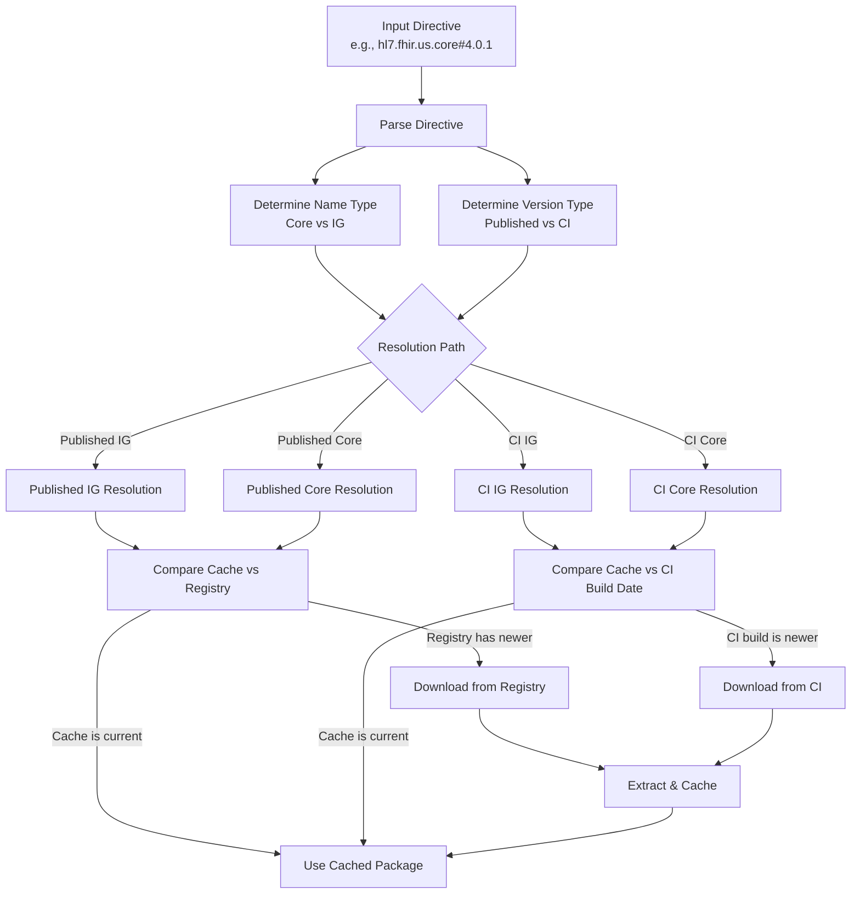
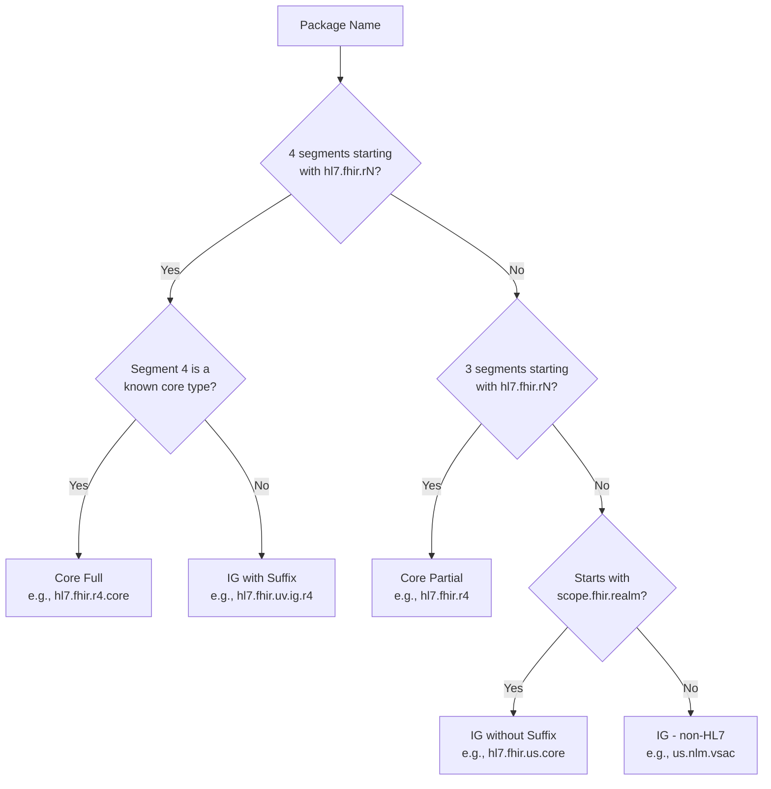
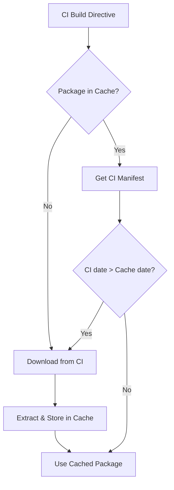
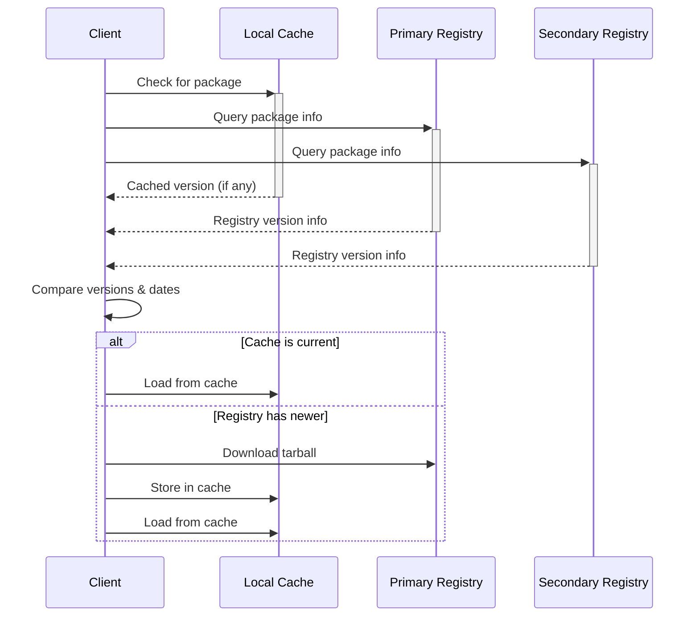

# Package Resolution

This document describes how a package directive (name + version) is resolved to a downloadable package tarball.

## High-Level Flow



## Step 1: Parse the Directive

Split the input into a package name and version specification.

| Input | Package Name | Version |
|-------|-------------|---------|
| `hl7.fhir.r4.core#4.0.1` | `hl7.fhir.r4.core` | `4.0.1` |
| `hl7.fhir.us.core@latest` | `hl7.fhir.us.core` | `latest` |
| `hl7.fhir.us.core` | `hl7.fhir.us.core` | _(implicit latest)_ |
| `hl7.fhir.r6.core@current` | `hl7.fhir.r6.core` | `current` |
| `hl7.fhir.us.core@current$R5` | `hl7.fhir.us.core` | `current$R5` |
| `v410@npm:hl7.fhir.us.core@4.1.0` | `hl7.fhir.us.core` | `4.1.0` |

Accept both `#` and `@` as version separators. Strip NPM alias prefixes (`alias@npm:`) before processing.

## Step 2: Classify the Directive

### Name Type Detection



Known core types: `core`, `expansions`, `examples`, `search`, `corexml`, `elements`

### Version Type Detection

| Version Pattern | Type | Resolution Path |
|----------------|------|-----------------|
| `X.Y.Z` (exact) | Exact | Published |
| `X.Y.Z-label` (pre-release) | Exact | Published |
| `X.Y.x`, `X.*`, `*` | Wildcard | Published (with registry query) |
| `latest`, _(empty)_ | Latest | Published |
| `current` | CI Build | CI |
| `current${branch}` | CI Build | CI (branch-specific) |
| `dev` | Local Build | Cache first, fallback to CI |

## Step 3: Resolve — Published IG Packages

### Discovery

1. **Search registries** for the package name (and FHIR-version suffixed variants):

```
GET https://packages.fhir.org/catalog?op=find&name=hl7.fhir.us.core
GET https://packages2.fhir.org/catalog?op=find&name=hl7.fhir.us.core
```

2. **Check for multi-version variants.** If the IG supports multiple FHIR versions, there may be suffixed packages:
   - `hl7.fhir.uv.extensions` (root — highest FHIR version)
   - `hl7.fhir.uv.extensions.r4` (R4 variant)
   - `hl7.fhir.uv.extensions.r4b` (R4B variant)

### Version Resolution

3. **Get the package listing** from the registry:

```
GET https://packages.fhir.org/hl7.fhir.us.core
```

Response (abbreviated):
```json
{
  "name": "hl7.fhir.us.core",
  "dist-tags": { "latest": "6.1.0" },
  "versions": {
    "4.0.0": {
      "name": "hl7.fhir.us.core",
      "version": "4.0.0",
      "fhirVersion": "4.0.1",
      "dist": {
        "shasum": "abc123...",
        "tarball": "https://packages.fhir.org/hl7.fhir.us.core/4.0.0"
      }
    },
    "6.1.0": {
      "name": "hl7.fhir.us.core",
      "version": "6.1.0",
      "fhirVersion": "4.0.1",
      "dist": {
        "shasum": "def456...",
        "tarball": "https://packages.fhir.org/hl7.fhir.us.core/6.1.0"
      }
    }
  }
}
```

4. **Select the version:**
   - **Exact:** Match against `versions` keys
   - **Latest:** Use `dist-tags.latest`
   - **Wildcard:** Apply SemVer matching (e.g., `semver.maxSatisfying()`) against all version keys

### Download

5. **Download the tarball:**

```
GET https://packages.fhir.org/hl7.fhir.us.core/6.1.0
```

Returns a gzip-compressed tar archive.

## Step 4: Resolve — Published Core Packages

### Name Expansion

If the directive uses a partial core name (e.g., `hl7.fhir.r4`), expand to full package names:

| Partial | Expanded To |
|---------|------------|
| `hl7.fhir.r4` | `hl7.fhir.r4.core` + `hl7.fhir.r4.expansions` (minimum) |
| `hl7.fhir.r5` | `hl7.fhir.r5.core` + `hl7.fhir.r5.expansions` (minimum) |

### Resolution

Follow the same registry query and download process as Published IG packages. Each expanded package is resolved independently.

### HL7 Website Fallback

When a new FHIR release is published but registries haven't yet been updated, core packages can be fetched directly from the HL7 website:

| Release Type | URL Pattern |
|-------------|-------------|
| Named release | `https://hl7.org/fhir/{release}/{package}.tgz` |
| Ballot | `https://hl7.org/fhir/{ballot}/{package}.tgz` |
| Versioned | `https://hl7.org/fhir/{version}/{package}.tgz` |

**Examples:**

```
https://hl7.org/fhir/R4/hl7.fhir.r4.core.tgz
https://hl7.org/fhir/R5/hl7.fhir.r5.expansions.tgz
https://hl7.org/fhir/2024Sep/hl7.fhir.r6.core.tgz
```

## Step 5: Resolve — CI Build IG Packages

### From Package Name

1. **Download the QA index:**

```
GET https://build.fhir.org/ig/qas.json
```

Response (abbreviated):
```json
[
  {
    "url": "http://hl7.org/fhir/us/core",
    "name": "US Core",
    "package-id": "hl7.fhir.us.core",
    "ig-ver": "7.0.0-ballot",
    "date": "Wed, Jan 15, 2025 12:00+0000",
    "repo": "HL7/US-Core/main/qa.json",
    "errs": 0,
    "warnings": 12
  }
]
```

2. **Find matching entries** by `package-id`. If a branch was specified (e.g., `current$R5`), filter by branch in the `repo` field.

3. **Select the newest** entry by date.

4. **Construct download URLs** from the `repo` field (strip trailing `/qa.json`):

```
Package:  https://build.fhir.org/ig/HL7/US-Core/main/package.tgz
Manifest: https://build.fhir.org/ig/HL7/US-Core/main/package.manifest.json
```

For FHIR-version-specific variants:
```
https://build.fhir.org/ig/HL7/US-Core/main/package.r4.tgz
```

### From CI URL

If a full CI build URL is provided:

1. Download the manifest: `{CI_URL}/package.manifest.json`
2. Extract package name, version, and build date
3. If manifest is unavailable, download the package and extract `package.json`

### Freshness Check

Compare the cached package's build date against the CI build's date:



> **Warning:** CI directives do not encode the GitHub organization/repo. If multiple forks have the same branch name, the QA index may contain conflicting entries. Prefer using full CI URLs for unambiguous resolution.

## Step 6: Resolve — CI Build Core Packages

CI builds of core packages use fixed URL patterns:

| Variant | URL Pattern |
|---------|-------------|
| Default branch | `https://build.fhir.org/{package-name}.tgz` |
| Named branch | `https://build.fhir.org/branches/{branch}/{package-name}.tgz` |
| Manifest | `https://build.fhir.org/{package-name}.manifest.json` |
| Version info | `https://build.fhir.org/version.info` |

**Examples:**

```
https://build.fhir.org/hl7.fhir.r6.core.tgz
https://build.fhir.org/branches/R5/hl7.fhir.r5.core.tgz
https://build.fhir.org/hl7.fhir.r6.core.manifest.json
```

### Version Discovery

1. Download the manifest: `{package-name}.manifest.json`
2. Or download `version.info` (INI format with `FhirVersion`, `buildId`, `date`)
3. Extract the build date for freshness comparison
4. If neither is available, download the package and extract metadata

## Parallel Resolution Strategy

Implementations should perform cache lookups and registry queries in parallel:



## Multiple Registry Considerations

- **Sync delays:** The primary and secondary registries may briefly have different versions. Query both and use the most current information.
- **Fallback:** If the primary registry is unreachable, fall back to the secondary (and vice versa).
- **Consistency:** The `dist-tags.latest` value may differ between registries during sync windows. Use the highest valid version found across all registries.
