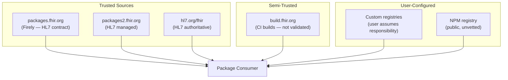

# Security

This document covers security considerations for FHIR package management: authentication, transport security, package integrity, and cache protection.

## Transport Security

### HTTPS

All package registries and CI build servers use HTTPS:

| Endpoint | Protocol |
|----------|----------|
| `packages.fhir.org` | HTTPS |
| `packages2.fhir.org` | HTTPS |
| `build.fhir.org` | HTTPS |
| `hl7.org/fhir` | HTTPS (some legacy links use HTTP) |

**Certificate validation** should be enforced by default. Implementations may offer an `insecure` mode for development/testing environments (e.g., self-signed certificates), but this should be explicitly opt-in.

### Redirect Handling

When following HTTP redirects:

- Redirects are followed up to the configured limit (`MaxRedirects`, default 5)
- Authorization and custom headers are re-attached **only** when the redirect
  destination exactly matches a trusted origin (scheme, host, and port), so
  credentials are never forwarded to a downgraded or cross-origin destination

## Authentication

### Registry Authentication

**FHIR registries** (`packages.fhir.org`, `packages2.fhir.org`) are currently public and do not require authentication for read operations.

**Custom/private registries** may require authentication:

| Implementation | Mechanism | Configuration |
|---------------|-----------|---------------|
| SUSHI | Bearer token | `FPL_REGISTRY_TOKEN` env var |
| Firely | HTTP client configuration | Custom `HttpClient` or `insecure` flag |
| CodeGen | Auth header + custom headers | `RegistryEndpointRecord.AuthHeaderValue` |
| Java Publisher | None built-in | — |

**Example: Configuring a private registry (SUSHI)**

```bash
export FPL_REGISTRY=https://my-private-registry.example.com
export FPL_REGISTRY_TOKEN=ghp_xxxxxxxxxxxxxxxxxxxx
```

**Example: Configuring a private registry (CodeGen)**

```csharp
var endpoint = new RegistryEndpointRecord
{
    Url = "https://my-private-registry.example.com/",
    RegistryType = RegistryEndpointRecord.RegistryTypeCodes.FhirNpm,
    AuthHeaderValue = "Bearer ghp_xxxxxxxxxxxxxxxxxxxx",
    CustomHeaders = new List<(string, string)>
    {
        ("X-Organization", "my-org")
    }
};
```

### Package Publish Authentication

Publishing packages requires authentication. The Firely implementation supports:

```csharp
var response = await client.Publish(reference, packageBuffer);
// Uses configured HttpClient with appropriate auth headers
```

## Package Integrity

### SHA Checksum Verification

Package registries include SHA checksums in version metadata:

```json
{
  "dist": {
    "shasum": "abc123def456...",
    "tarball": "https://packages.fhir.org/hl7.fhir.us.core/6.1.0"
  }
}
```

**Verification process:**

1. Download the tarball
2. Always compute the SHA-256 hash of the content (verified first when available)
3. When the registry supplies a `shasum`, also compute and compare the SHA-1 hash
4. Reject the package if any available checksum does not match

**Implementation support:**

| Implementation | Checksum Verification |
|---------------|----------------------|
| SUSHI | Not implemented |
| FhirPkg | ✅ `CheckSum` utility (SHA-256 always; SHA-1 when supplied) |
| CodeGen | ✅ Via `ResolvedDirectiveUri.ShaSum` |
| Java Publisher | Not implemented |

### Post-Extraction Validation

After extracting a package, validate:

1. **Manifest present:** `package/package.json` must exist
2. **Name matches:** Manifest `name` should match the requested package
3. **Version matches:** Manifest `version` should match the resolved version
4. **Structure valid:** Package contents should be within the `package/` directory

### Client-Side Install Limits

FhirPkg enforces hard archive/extraction limits while installing a package, so a
malicious or malformed tarball cannot exhaust disk or memory. Defaults come from
`PackageInstallLimits`; each is overridable via a `FHIRPKG_MAX_*` environment
variable, and a per-call override may only **tighten** a limit:

| Limit | Default | Environment override |
|-------|---------|----------------------|
| Compressed archive size | 100 MiB | `FHIRPKG_MAX_COMPRESSED_BYTES` |
| Expanded size | 1 GiB | `FHIRPKG_MAX_EXPANDED_BYTES` |
| Single entry size | 128 MiB | `FHIRPKG_MAX_ENTRY_BYTES` |
| Entry count | 50,000 | `FHIRPKG_MAX_ARCHIVE_ENTRIES` |
| Entry path length | 1,024 | `FHIRPKG_MAX_ARCHIVE_PATH_LENGTH` |
| Path depth | 32 | `FHIRPKG_MAX_ARCHIVE_DEPTH` |

## Server-Side Security

> **External context:** This section describes protections implemented by the
> registry and CI **servers**, observed through their public behavior. They are
> not implemented or enforced by FhirPkg and cannot be verified from this
> repository.

### Request Validation

The package server validates all incoming requests:

- **Parameter pollution detection:** Arrays in query parameters are rejected (HTTP 400)
- **Parameter validation:** Each parameter is checked for type, length, and pattern
- **Unknown parameters:** Rejected with HTTP 400

### URL Validation for External Requests

When the server fetches from external URLs (e.g., during crawling):

- **Protocol restriction:** Only `http://` and `https://` allowed
- **Private IP blocking:** Requests to private/internal IPs are blocked:
  - `127.0.0.0/8` (loopback)
  - `10.0.0.0/8` (private)
  - `192.168.0.0/16` (private)
  - `172.16.0.0/12` (private)
- **Size limits:** Content-Length checked against maximum (default: 50 MB)
- **Timeout protection:** Default 30-second timeout
- **Redirect limits:** Maximum 5 redirects

### Response Security Headers

All server responses include:

```http
X-Content-Type-Options: nosniff
X-Frame-Options: DENY
X-XSS-Protection: 1; mode=block
Referrer-Policy: strict-origin-when-cross-origin
Content-Security-Policy: default-src 'self'; ...
```

The `X-Powered-By` header is removed.

## Cache Security

### File Permissions

The local package cache (`~/.fhir/packages/`) should be restricted to the current user:

```bash
# Linux/macOS
chmod 700 ~/.fhir/packages/
```

### No Credential Storage

Package cache directories should not contain credentials. Authentication tokens should be provided via:

- Environment variables (preferred)
- Configuration files outside the cache
- In-memory configuration

### Atomic Installation

Packages are extracted to a temporary directory first, then atomically moved to the cache. This prevents:

- Partial extraction (interrupted downloads)
- Race conditions (concurrent installations)
- Cache corruption

## Trust Model



**Trust levels:**

| Source | Trust Level | Validation |
|--------|------------|------------|
| Primary/Secondary registries | High | Official, curated |
| HL7 website | Highest | Authoritative publication |
| CI builds | Medium | Automated, may contain errors |
| Custom registries | User-dependent | User must vet |
| NPM registry | Low | Public, anyone can publish |

## Proxy Support

For environments behind corporate proxies:

| Implementation | Proxy Configuration |
|---------------|-------------------|
| SUSHI | `HTTPS_PROXY` environment variable |
| Firely | Custom `HttpClient` with proxy handler |
| CodeGen | Custom `HttpClient` with proxy handler |
| Java Publisher | JVM proxy settings |

```bash
# SUSHI proxy configuration
export HTTPS_PROXY=http://proxy.example.com:8080
```

## Certificate Handling

For environments with custom CA certificates:

```bash
# Node.js (SUSHI)
export NODE_EXTRA_CA_CERTS=/path/to/custom-ca.pem
```

For .NET implementations, configure the `HttpClient` with custom certificate handling or install certificates in the system trust store.
