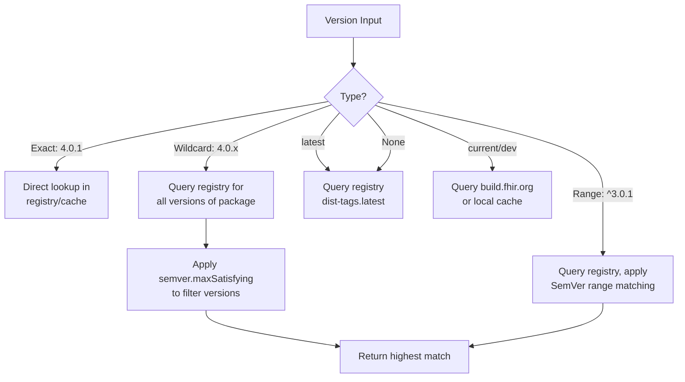

# Versioning

FHIR packages use a versioning scheme based on [Semantic Versioning](https://semver.org/) with FHIR-specific extensions. This document covers version formats, resolution rules, comparison semantics, and special version tags.

## Version Format

The standard version format is:

```
{major}.{minor}.{patch}[-{prerelease}][+{buildmetadata}]
```

**Examples:**

```
4.0.1                # Release
6.0.0-ballot1        # Pre-release (ballot)
1.0.0-snapshot2      # Pre-release (snapshot)
5.0.0-cibuild        # CI build pre-release
1.2.3+20240115       # Release with build metadata
```

## Version Categories

Versions in the FHIR ecosystem fall into five categories, each with different resolution behavior:

### 1. Exact Versions

Fully qualified version strings that require a precise match.

```
4.0.1
6.0.0-ballot1
1.0.0
```

- **Cache behavior:** Direct lookup by name + version
- **Registry behavior:** Used to fetch a specific version

### 2. Partial Versions (Wildcards)

Versions with missing or wildcard components that resolve to the highest matching exact version.

| Pattern | Meaning | Example |
|---------|---------|---------|
| `X.Y.x` | Any patch in X.Y | `4.0.x` → `4.0.1` |
| `X.x` | Any minor+patch in X | `4.x` → `4.3.0` |
| `X.Y.*` | Same as `X.Y.x` | `4.0.*` → `4.0.1` |
| `*` | Any version | `*` → latest |
| `X.Y` | Treated as `X.Y.x` | `4.0` → `4.0.1` |

**Valid wildcard characters:** `x`, `X`, `*`

**Rules:**
- `*` is terminal — it matches the current and all remaining segments
- `x`/`X` matches only the current segment
- Wildcard literals **never** appear in the cache; they always resolve to exact versions
- Registry must be consulted each time a wildcard is resolved (no cache shortcut)

### 3. Version Tags

Special labels that map to dynamic versions:

| Tag | Meaning | Resolution Source |
|-----|---------|-------------------|
| `latest` | Most recent published release | Registry `dist-tags.latest` |
| `dev` | Most recent local build | Local cache; falls back to `current` |
| `current` | Current CI build (default branch) | `build.fhir.org` |
| `current${branch}` | CI build for a specific branch | `build.fhir.org` with branch filter |

**Examples:**

```
hl7.fhir.us.core@latest          # Latest published US Core
hl7.fhir.r6.core@current         # Current CI build of R6
hl7.fhir.us.core@current$R5      # CI build from R5 branch
hl7.fhir.r4.core@dev             # Local dev build
```

### 4. Version Ranges

Some clients support SemVer range expressions:

| Pattern | Meaning | Example |
|---------|---------|---------|
| `^X.Y.Z` | Compatible with X.Y.Z | `^3.0.1` → `≥3.0.1, <4.0.0` |
| `~X.Y.Z` | Approximately X.Y.Z | `~3.0.1` → `≥3.0.1, <3.1.0` |
| `X.Y.Z - A.B.C` | Between (inclusive) | `3.0.1 - 3.0.3` |
| `X.Y.Z \| A.B.C` | Either version | `1.0.0 \| 2.0.0` |

> **Note:** Range expressions are primarily supported by the Firely C# implementation. Other implementations may have more limited support.

### 5. No Version (Implicit Latest)

When no version is specified, it resolves to the latest published version:

```
hl7.fhir.us.core     # Resolves to latest published version
```

## Version Comparison Rules

### HL7 Packages

HL7 packages follow FHIR's variation of SemVer as documented in [FHIR Releases and Versioning](https://hl7.org/fhir/versions.html#versions).

**Between releases:** Standard SemVer comparison is reliable.

**Pre-release ordering:** FHIR defines a specific hierarchy for pre-release tags:

```
release > ballot > draft > snapshot > cibuild > other
```

In concrete terms:

```
1.0.0 > 1.0.0-ballot1 > 1.0.0-draft1 > 1.0.0-snapshot1 > 1.0.0-cibuild
```

> **Warning:** Ordering between arbitrary pre-release tags (e.g., `1.0.0-ballot` vs `1.0.0-snapshot2`) is **not** universally reliable. When in doubt, use publication dates for ordering.

### CI Builds

CI build versions are not meaningful for ordering. Freshness is determined exclusively by comparing **build dates**, not version strings.

### Using Publication Dates

The secondary registry (`packages2.fhir.org`) includes `date` information in its responses, which can be used to determine ordering when version comparison is ambiguous. CI build freshness is always determined by date comparison.

## FHIR Version to Release Mapping

| Release | Version | Package Prefix |
|---------|---------|---------------|
| DSTU2 | `1.0.2` | `hl7.fhir.r2` |
| STU3 | `3.0.2` | `hl7.fhir.r3` |
| R4 | `4.0.1` | `hl7.fhir.r4` |
| R4B | `4.3.0` | `hl7.fhir.r4b` |
| R5 | `5.0.0` | `hl7.fhir.r5` |
| R6 | `6.0.0` | `hl7.fhir.r6` |

## Version Resolution Examples



### Worked Examples

**Resolving `hl7.fhir.us.core@4.0.x`:**

1. Query registry: `GET https://packages.fhir.org/hl7.fhir.us.core`
2. Response includes versions: `4.0.0`, `4.1.0`, `5.0.0`, `6.1.0`
3. Apply wildcard `4.0.x` → matches `4.0.0` only
4. Result: `4.0.0`

**Resolving `hl7.fhir.us.core@latest`:**

1. Query registry: `GET https://packages.fhir.org/hl7.fhir.us.core`
2. Response includes `dist-tags: { "latest": "6.1.0" }`
3. Result: `6.1.0`

**Resolving `hl7.fhir.us.core@current`:**

1. Download QA index: `GET https://build.fhir.org/ig/qas.json`
2. Find entry where `package-id` = `hl7.fhir.us.core` (newest by date)
3. Extract repo path, build download URL
4. Check cached build date vs. CI build date
5. Download if CI is newer
