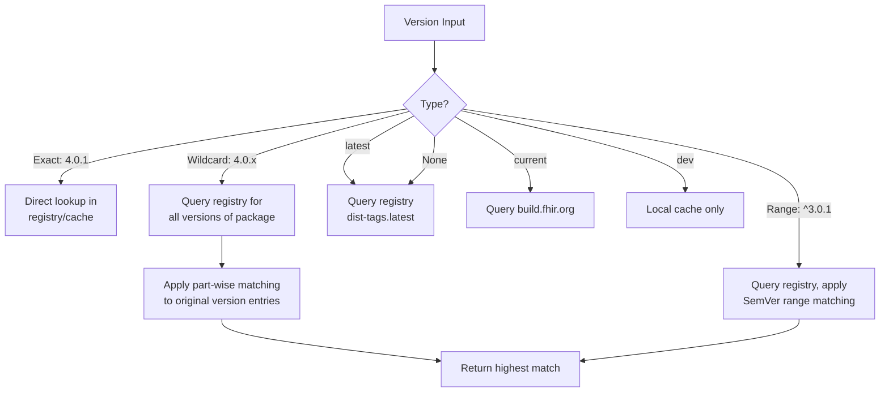

# Versioning

FHIR packages use a versioning scheme based on [Semantic Versioning](https://semver.org/) with FHIR-specific extensions. This document covers version formats, resolution rules, comparison semantics, and special version tags.

## Version Format

Concrete versions use two or three numeric parts:

```
{major}.{minor}[.{patch}][-{prerelease}][+{buildmetadata}]
```

**Examples:**

```
4.0.1                # Release
4.0                  # Exact two-part release
6.0.0-ballot1        # Pre-release (ballot)
1.0.0-snapshot2      # Pre-release (snapshot)
5.0.0-cibuild        # CI build pre-release
1.2.3+20240115       # Release with build metadata
```

## Version Categories

Versions in the FHIR ecosystem fall into five categories, each with different resolution behavior:

### 1. Exact Versions

Concrete two-part and three-part strings require a precise, shape-preserving
match.

```
4.0
4.0.1
6.0.0-ballot1
1.0.0
```

- `4.0` and `4.0.0` are different exact versions.
- An omitted patch, pre-release, or build part requires that part to be absent.
- Exact matching includes pre-release/build text even though build metadata is
  ignored for precedence and concrete equality.
- **Cache behavior:** Direct lookup by name + version
- **Registry behavior:** Used to fetch a specific version

### 2. Part-wise Wildcard Patterns

FHIR wildcard matching follows the component rules recorded in
[FHIR-52895](https://jira.hl7.org/browse/FHIR-52895). Each major, minor, patch,
pre-release, and build part is matched independently.

| Pattern | Matches | Does not match |
|---------|---------|----------------|
| `2.*` | Stable, build-free two-part versions such as `2.0`, `2.1` | `2.0.0`, `2.0-alpha` |
| `2.x.x` | Stable, build-free three-part versions in major 2 | `2.0`, `2.0.0-alpha` |
| `2.0.*` | Stable, build-free three-part versions in `2.0` | `2.0`, `2.0.0+build` |
| `*.0`, `*.0.0`, `2.*.0` | Versions with the stated part count and literal parts | Shapes or literal parts that differ |
| `2.0.0-*` | A `2.0.0` pre-release with no build label | `2.0.0`, `2.0.0-alpha+build` |
| `2.0.0+*` | A stable `2.0.0` with a build label | `2.0.0`, `2.0.0-alpha+build` |
| `2.0.x-*` | A three-part `2.0` pre-release with no build label | Stable or build-qualified versions |
| `2.0?` | `2.0` plus any remaining parts | A different major/minor |
| `2.0.1?` | `2.0.1` plus any pre-release/build remainder | A missing or different patch |
| `2.x?` | Major 2 with any minor and any remainder | A different major |
| `*` | Any concrete supported version, subject to pre-release policy | Wildcard pattern objects |

**Rules:**

- A missing pattern part requires the candidate part to be missing. A wildcard
  part requires it to be present. A literal part must match exactly.
- `*` may occupy any supported numeric, pre-release, or build part, including
  non-trailing forms such as `*.0`, `*.0.0`, and `2.*.0`.
- `x` and `X` alias `*` only in numeric minor and patch parts. They are literal
  text in pre-release and build labels.
- A trailing `?` attaches to the current complete part. Once that part matches,
  every remaining part is ignored.
- Wildcard literals **never** appear in the cache; they always resolve to exact versions
- Registry selection filters the original version entries directly, preserving
  build-qualified keys and source priority before choosing the highest match.

`FhirSemVer.MaxSatisfying` may consider pre-releases when a standalone pattern
explicitly requires a pre-release (for example, `2.0.0-*`). Package resolution
still applies `AllowPreRelease` first: when it is `false`, every pre-release
candidate is excluded, including candidates for `-*` patterns.

### 3. Version Tags

Special labels that map to dynamic versions:

| Tag | Meaning | Resolution Source |
|-----|---------|-------------------|
| `latest` | Most recent published release | Registry `dist-tags.latest` |
| `dev` | Most recent local build | Local cache only (no registry or CI fallback; fails if absent) |
| `current` | Current CI build (default branch) | `build.fhir.org` |
| `current${branch}` | CI build for a specific branch | `build.fhir.org` with branch filter |

**Examples:**

```
hl7.fhir.us.core@latest          # Latest published US Core
hl7.fhir.r6.core@current         # Current CI build of R6
hl7.fhir.us.core@current$R5      # CI build from R5 branch
hl7.fhir.r4.core@dev             # Local dev build
```

### 4. Version Ranges

The SDK supports this SemVer range grammar:

| Pattern | Meaning | Example |
|---------|---------|---------|
| `X.Y`, `X.Y.Z` | Exact version | `3.0`, `3.0.1` |
| Part-wise `*`, numeric `x`/`X`, or trailing `?` | Wildcard version | `3.0.x`, `3.x?`, `3.0.0-*` |
| `^X.Y.Z` | Compatible with X.Y.Z | `^3.0.1` → `≥3.0.1, <4.0.0` |
| `~X.Y.Z` | Approximately X.Y.Z | `~3.0.1` → `≥3.0.1, <3.1.0` |
| `X.Y.Z - A.B.C` | Between (inclusive) | `3.0.1 - 3.0.3` |
| `<`, `<=`, `>`, `>=`, `=` | Compare with an exact version | `>=3.0.1` |
| Comparators separated by whitespace | Intersection (AND) | `>=3.0.1 <4.0.0` |
| Alternatives separated by `\|` | Alternative (OR) | `1.0.0 \| >=2.0.0 <3.0.0` |

Comparator operators may be adjacent to their version or separated from it by
whitespace. Hyphen ranges require whitespace around the hyphen. Caret, tilde,
hyphen, and comparator operands must be concrete three-part versions; standalone
two-part exact versions and wildcards are supported as alternatives. A
pipe-separated alternative can use any one of the forms above.

Caret ceilings follow the first non-zero component:

| Range | Equivalent bounds |
|-------|-------------------|
| `^1.2.3` | `>=1.2.3 <2.0.0` |
| `^0.2.3` | `>=0.2.3 <0.3.0` |
| `^0.0.3` | `>=0.0.3 <0.0.4` |

### 5. No Version (Implicit Latest)

When no version is specified, it resolves to the latest published version:

```
hl7.fhir.us.core     # Resolves to latest published version
```

## Version Comparison Rules

### HL7 Packages

HL7 packages follow FHIR's variation of SemVer as documented in [FHIR Releases and Versioning](https://hl7.org/fhir/versions.html#versions).

**Between releases:** Standard SemVer comparison is reliable.

**Pre-release ordering:** FHIR defines a specific hierarchy for pre-release tags:

```
release > ballot > draft > snapshot > cibuild > other
```

In concrete terms:

```
1.0.0 > 1.0.0-ballot1 > 1.0.0-draft1 > 1.0.0-snapshot1 > 1.0.0-cibuild
```

> **Warning:** Ordering between arbitrary pre-release tags (e.g., `1.0.0-ballot` vs `1.0.0-snapshot2`) is **not** universally reliable. When in doubt, use publication dates for ordering.

### CI Builds

CI build versions are not meaningful for ordering. Freshness is determined exclusively by comparing **build dates**, not version strings.

### Using Publication Dates

The secondary registry (`packages2.fhir.org`) includes `date` information in its responses, which can be used to determine ordering when version comparison is ambiguous. CI build freshness is always determined by date comparison.

## FHIR Version to Release Mapping

| Release | Version | Package Prefix |
|---------|---------|---------------|
| DSTU2 | `1.0.2` | `hl7.fhir.r2` |
| STU3 | `3.0.2` | `hl7.fhir.r3` |
| R4 | `4.0.1` | `hl7.fhir.r4` |
| R4B | `4.3.0` | `hl7.fhir.r4b` |
| R5 | `5.0.0` | `hl7.fhir.r5` |
| R6 | `6.0.0` | `hl7.fhir.r6` |

## Version Resolution Examples


```mermaid
flowchart TD
    A[Version Input] --> B{Type?}
    B -->|Exact: 4.0.1| C[Direct lookup in<br/>registry/cache]
    B -->|Wildcard: 4.0.x| D[Query registry for<br/>all versions of package]
    B -->|latest| E[Query registry<br/>dist-tags.latest]
    B -->|current| F[Query build.fhir.org]
    B -->|dev| Fd[Local cache only]
    B -->|Range: ^3.0.1| G[Query registry, apply<br/>SemVer range matching]
    B -->|None| E
    D --> H[Apply part-wise matching<br/>to original version entries]
    H --> I[Return highest match]
    G --> I
```

### Worked Examples

**Resolving `hl7.fhir.us.core@4.0.x`:**

1. Query registry: `GET https://packages.fhir.org/hl7.fhir.us.core`
2. Response includes versions: `4.0.0`, `4.1.0`, `5.0.0`, `6.1.0`
3. Apply wildcard `4.0.x` → matches `4.0.0` only
4. Result: `4.0.0`

**Resolving `hl7.fhir.us.core@latest`:**

1. Query registry: `GET https://packages.fhir.org/hl7.fhir.us.core`
2. Response includes `dist-tags: { "latest": "6.1.0" }`
3. Result: `6.1.0`

**Resolving `hl7.fhir.us.core@current`:**

1. Download QA index: `GET https://build.fhir.org/ig/qas.json`
2. Find entry where `package-id` = `hl7.fhir.us.core` (newest by date)
3. Extract repo path, build download URL
4. Check cached build date vs. CI build date
5. Download if CI is newer
